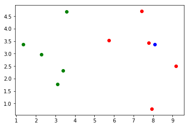

# kNN 算法

邻近算法，或者说K最近邻(kNN，k-NearestNeighbor)分类算法是数据挖掘分类技术中最简单的方法之一。 所谓K最近邻，就是k个最近的邻居的意思，说的是每个样本都可以用它最接近的k个邻居来代表。

## 应用简单实现

根据下述过程可以看到，可以说kNN是一个不需要训练过程的算法。

k近邻算法是非常特殊的，可以被认为是没有模型的算法。

为了和其他算法统一，可以认为训练数据集就是模型本身。

- 首先我们自己造一个数据集

```python
import numpy as np
import matplotlib.pyplot as plt

raw_data_X = [[3.393, 2.331],
             [3.110, 1.782],
             [1.343, 3.368],
             [3.582, 4.679],
             [2.280, 2.967],
             [7.423, 4.697],
             [5.745, 3.534],
             [9.172, 2.511],
             [7.792, 3.424],
             [7.940, 0.792]]

raw_data_y = [0, 0, 0, 0, 0, 1, 1, 1, 1, 1]

X_train = np.array(raw_data_X)
y_train = np.array(raw_data_y)

x = np.array([8.094, 3.366])
```

- 画散点图

```python
plt.scatter(X_train[y_train==0,0], X_train[y_train==0,1], color='g')
plt.scatter(X_train[y_train==1,0], X_train[y_train==1,1], color='r')
plt.scatter(x[0], x[1], color='b')
plt.show()
```



- 我们封装一个我们自己的 kNN 算法

```python
import numpy as np
from math import sqrt
from collections import Counter

def kNN_classify(k, X_train, y_train, x):
    assert 1 <= k <= X_train.shape[0], "k must be vaild"
    assert X_train.shape[0] == y_train.shape[0], ("the size"
        + " of X_train must be equal to the size of y_train")
    assert X_train.shape[1] == x.shape[0], ("the feature "
        + "number of x must be equal to X_train")

    distances = [sqrt(np.sum((x_train - x) ** 2)) for x_train in X_train]
    nearest = np.argsort(distances)

    topK_y = [y_train[i] for i in nearest[:k]]
    votes = Counter(topK_y)

    return votes.most_common(1)[0][0]
```

- 使用我们自己封装的 kNN 算法

```python
predict_y = kNN_classify(k=3, X_train=X_train, y_train=y_train, x=x)
predict_y
```

1

## 使用scikit-learn中的kNN

```python
from sklearn.neighbors import KNeighborsClassifier

kNN_classifier = KNeighborsClassifier(n_neighbors=6)
kNN_classifier.fit(X_train, y_train)
```

KNeighborsClassifier(algorithm='auto', leaf_size=30, metric='minkowski',

metric_params=None, n_jobs=1, n_neighbors=6, p=2,

weights='uniform')

```python
# 将要预测的数据放入一个矩阵
X_predict = x.reshape(1, -1)
y_predict = kNN_classifier.predict(X_predict)
y_predict[0]
```

1

## 重新整理kNN代码

我们模仿 sklearn 中的kNN实现，改造我们自己的 kNN 算法实现

1. 面向对象
2. 批量预测

```python
import numpy as np
from math import sqrt
from collections import Counter

class kNNClassifier():

    def __init__(self, k):
        assert k >=1, "k must valid"
        self.k = k
        self._X_train = None
        self._y_train = None

    def fit(self, X_train, y_train):
        assert X_train.shape[0] == y_train.shape[0], ("the "
        + "size of X_train must be equal to the size of "
        + "y_train")
        assert self.k <= X_train.shape[0], ("the size of "
            + "X_train must be at least k")
        self._X_train = X_train
        self._y_train = y_train
        return self

    def predict(self, X_predict):
        assert (self._X_train is not None and
            self._y_train is not None),("must fit "
            + "before predict")
        assert X_predict.shape[1] == self._X_train.shape[1],\
            ("the feature number of X_predict must be equal"
            + " to X_train")
        y_predict = [self._predict(x) for x in X_predict]
        return np.array(y_predict)

    def _predict(self, x):
        distances = [sqrt(np.sum((x_train - x) ** 2)) for x_train in self._X_train]
        nearest = np.argsort(distances)

        topK_y = [self._y_train[i] for i in nearest[:self.k]]
        votes = Counter(topK_y)

        return votes.most_common(1)[0][0]

    def __repr__(self):
        return "kNN(k=%d)" % self.k
```

```python
kNN_classifier_re = kNNClassifier(6)
kNN_classifier_re.fit(X_train, y_train)
```

kNN(k=6)

```python
y_predict_re = kNN_classifier_re.predict(X_predict)
y_predict_re[0]
```

1
