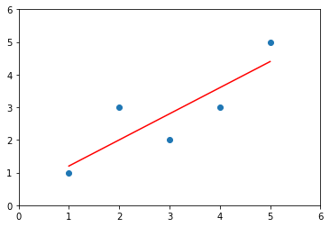

<head>
    <script src="https://cdn.mathjax.org/mathjax/latest/MathJax.js?config=TeX-AMS-MML_HTMLorMML" type="text/javascript"></script>
    <script type="text/x-mathjax-config">
        MathJax.Hub.Config({
            tex2jax: {
            skipTags: ['script', 'noscript', 'style', 'textarea', 'pre'],
            inlineMath: [['$','$']]
            }
        });
    </script>
</head>

# 线性回归简单实现

根据上一小结得出的结论，简单实现一个线性回归算法。

```python
import numpy as np
import matplotlib.pyplot as plt

x = np.array([1,2,3,4,5], dtype=float)
y = np.array([1,3,2,3,5], dtype=float)

plt.scatter(x, y)
plt.axis([0,6,0,6])
plt.show()
```


## 实现最小二乘法

$$a = \frac{\sum_{i=1}^m(x^{(i)} - \bar{x})(y^{(i)} - \bar{y})}{\sum_{i=1}^m(x^{(i)} - \bar{x})^2}$$

$$b = \bar{y} - a\bar{x}$$

```python
x_mean = np.mean(x)
y_mean = np.mean(y)

num = 0.0
d = 0.0

a = np.sum((x - x_mean) * (y - y_mean)) / np.sum((x - x_mean) ** 2)
b = y_mean - a * x_mean

a
```

0.8


```python
b
```

0.39999999999999947

```python
y_hat = a * x + b
```

```python
plt.scatter(x, y)
plt.plot(x, y_hat, color='r')
plt.axis([0,6,0,6])
plt.show()
```



```python
x_predict = 6.0
y_predict = a * x_predict + b
y_predict
```

5.2

### 使用自己封装的线性回归

```python
import numpy as np

class SimpleLinearRegressionV1:

    def __init__(self):
        self.a_ = None
        self.b_ = None

    def fit(self, x_train, y_train):
        assert x_train.ndim == 1 and y_train.ndim == 1,\
            "needs single feature train data"
        assert len(x_train) == len(y_train),\
            "the size of x and y must be equals"
        x_mean = np.mean(x_train)
        y_mean = np.mean(y_train)
        self.a_ = np.sum((x_train - x_mean) * (y_train - y_mean)) / np.sum((x_train - x_mean) ** 2)
        self.b_ = y_mean - self.a_ * x_mean
        return self

    def predict(self, x_predict):
        assert isinstance(x_predict, (int, float)) or x_predict.ndim == 1,\
            "needs single feature data to predict"
        assert self.a_ is not None and self.b_ is not None,\
            "must be fit before oredict"
        return self.a_ * x_predict + self.b_

    def __repr__(self):
        return "SimpleLinearRegressionV1()"
```

```python
slr = SimpleLinearRegressionV1()
slr.fit(x, y)
```

SimpleLinearRegressionV1

```python
slr.predict(x_predict)
```

5.2
