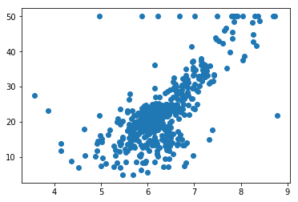
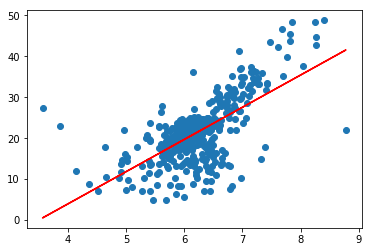

<head>
    <script src="https://cdn.mathjax.org/mathjax/latest/MathJax.js?config=TeX-AMS-MML_HTMLorMML" type="text/javascript"></script>
    <script type="text/x-mathjax-config">
        MathJax.Hub.Config({
            tex2jax: {
            skipTags: ['script', 'noscript', 'style', 'textarea', 'pre'],
            inlineMath: [['$','$']]
            }
        });
    </script>
</head>

# 衡量回归算法的标准

## 将测试数据集带入计算损失函数

$$\sum_{i=0}^m(y_{test}^{(i)} - \hat{y}_{test}^{(i)})^2$$

*问题：结果和 m 有关*

## 均方误差MSE

$$\frac{1}{m}\sum_{i=0}^m(y_{test}^{(i)} - \hat{y}_{test}^{(i)})^2$$
*问题：结果受量纲影响*

## 均方根误差RMSE

$$\sqrt{\frac{1}{m}\sum_{i=0}^m(y_{test}^{(i)} - \hat{y}_{test}^{(i)})^2} = \sqrt{MSE_{test}}$$

## 平均绝对误差MAE

$$\frac{1}{m}\sum_{i=0}^m|y_{test}^{(i)} - \hat{y}_{test}^{(i)}|$$

## 波士顿房产数据

```python
import numpy as np
import matplotlib.pyplot as plt
from sklearn import datasets

boston = datasets.load_boston()
print(boston.DESCR)
```

    Boston House Prices dataset
    ===========================

    Notes
    ------
    Data Set Characteristics:  

        :Number of Instances: 506

        :Number of Attributes: 13 numeric/categorical predictive

        :Median Value (attribute 14) is usually the target

        :Attribute Information (in order):
            - CRIM     per capita crime rate by town
            - ZN       proportion of residential land zoned for lots over 25,000 sq.ft.
            - INDUS    proportion of non-retail business acres per town
            - CHAS     Charles River dummy variable (= 1 if tract bounds river; 0 otherwise)
            - NOX      nitric oxides concentration (parts per 10 million)
            - RM       average number of rooms per dwelling
            - AGE      proportion of owner-occupied units built prior to 1940
            - DIS      weighted distances to five Boston employment centres
            - RAD      index of accessibility to radial highways
            - TAX      full-value property-tax rate per $10,000
            - PTRATIO  pupil-teacher ratio by town
            - B        1000(Bk - 0.63)^2 where Bk is the proportion of blacks by town
            - LSTAT    % lower status of the population
            - MEDV     Median value of owner-occupied homes in $1000's

        :Missing Attribute Values: None

        :Creator: Harrison, D. and Rubinfeld, D.L.

    This is a copy of UCI ML housing dataset.
    http://archive.ics.uci.edu/ml/datasets/Housing


    This dataset was taken from the StatLib library which is maintained at Carnegie Mellon University.

    The Boston house-price data of Harrison, D. and Rubinfeld, D.L. 'Hedonic
    prices and the demand for clean air', J. Environ. Economics & Management,
    vol.5, 81-102, 1978.   Used in Belsley, Kuh & Welsch, 'Regression diagnostics
    ...', Wiley, 1980.   N.B. Various transformations are used in the table on
    pages 244-261 of the latter.

    The Boston house-price data has been used in many machine learning papers that address regression
    problems.

    **References**

       - Belsley, Kuh & Welsch, 'Regression diagnostics: Identifying Influential Data and Sources of Collinearity', Wiley, 1980. 244-261.
       - Quinlan,R. (1993). Combining Instance-Based and Model-Based Learning. In Proceedings on the Tenth International Conference of Machine Learning, 236-243, University of Massachusetts, Amherst. Morgan Kaufmann.
       - many more! (see http://archive.ics.uci.edu/ml/datasets/Housing)

```python
boston.feature_names
```

array(['CRIM', 'ZN', 'INDUS', 'CHAS', 'NOX', 'RM', 'AGE', 'DIS', 'RAD',
           'TAX', 'PTRATIO', 'B', 'LSTAT'], dtype='<U7')

```python
x = boston.data[:,5] # 暂时只使用房间的数量
y = boston.target
```

```python
plt.scatter(x, y)
plt.show()
```



```python
np.max(y)
```

50.0

```python
x = x[y < 50]
y = y[y < 50]
```

```python
plt.scatter(x, y)
plt.show()
```


```python
x_train, x_test, y_train, y_test = train_test_split(x, y, seed=666)
```

```python
slr = SimpleLinearRegressionV2()
slr.fit(x_train, y_train)
```

SimpleLinearRegressionV2()

```python
plt.scatter(x_train, y_train)
plt.plot(x_train, slr.predict(x_train), color='r')
```

[<matplotlib.lines.Line2D at 0x937cb00>]



```python
y_predict = slr.predict(x_test)
```

### MSE

```python
mse_test = np.sum((y_test - y_predict) ** 2) / len(x_test)
mse_test
```

24.156602134387438

### RMSE

```python
rmse_test = np.sqrt(mse_test)
rmse_test
```

4.914936635846635

### MAE

```python
mae_test = np.sum(np.abs(y_test - y_predict)) / len(x_test)
mae_test
```

3.5430974409463873

### 使用自己封装的函数

```python
def mean_squared_error(y_true, y_predict):
    assert len(y_true) == len(y_predict),\
        "the size of y_true must be equal to the size of y_predict"
    return np.sum((y_true - y_predict) ** 2) / len(y_true)

def root_mean_squared_error(y_true, y_oredict):
    return np.sqrt(mean_squared_error(y_true, y_oredict))

def mean_absolute_error(y_true, y_predict):
    assert len(y_true) == len(y_predict),\
        "the size of y_true must be equal to the size of y_predict"
    return np.sum(np.abs(y_true - y_predict)) / len(y_true)
```

```python
mean_squared_error(y_test, y_predict)
```

24.156602134387438

```python
root_mean_squared_error(y_test, y_predict)
```

4.914936635846635

```python
mean_absolute_error(y_test, y_predict)
```

3.5430974409463873

### scikit-lean 中的 MSE 和MAE

```python
from sklearn.metrics import mean_squared_error, mean_absolute_error
```

```python
mean_squared_error(y_test, y_predict)
```

24.156602134387438

```python
np.sqrt(mean_squared_error(y_test, y_predict))
```

4.914936635846635

```python
mean_absolute_error(y_test, y_predict)
```

3.5430974409463873

### R Square

见下节
