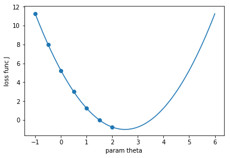

# 梯度下降法（Gradient Descent）

- 不是一个机器学习算法
- 是一种基于搜索的优化方法
- 作用：最小化一个损失函数
- 梯度上升法：最大化一个效用函数

```python
import matplotlib.pyplot as plt
import numpy as np
plot_x = np.linspace(-1, 6, 141)
# 损失函数
plot_y = (plot_x - 2.5) ** 2 - 1
plt.plot(plot_x, plot_y)
plt.scatter(plot_x[:70:10], plot_y[:70:10])
plt.xlabel("param theta")
plt.ylabel("loss func J")
plt.show()
```



$$\frac{dJ}{d\theta}$$

- 在直线和曲线方程中，导数代表切线的斜率
- 导数代表theta单位变化时，J相应的变化
- 导数可以代表方向，对应J增大的方向

我们将θ向导数小的方向移动，来获得极值，如下式

$$-\eta\frac{dJ}{d\theta}$$

- η被称为学习率（learning rate）
- η的取值影响获得最优解的速度
- η取值不合适，设置得不到最优解
- η是梯度下降法的一个超参数

## η取值影响

- 过小，收敛速度慢
- 过大，可能导致不收敛

## 注意

- 并不是所有函数都有唯一的极值点（可能会找到局部最优解，并不是全局最优解）
- 多次运行，随机化初始点
- 梯度下降法的初始点也是一个超参数
