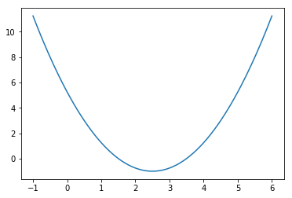
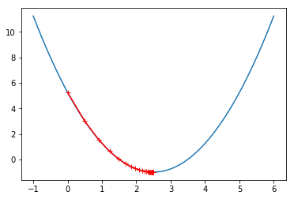
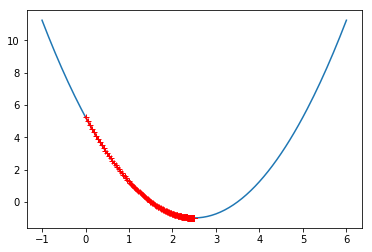
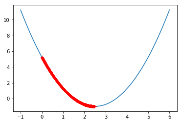
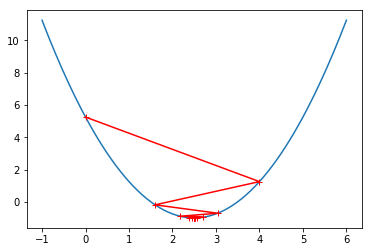
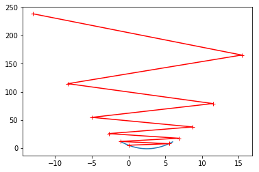

# 梯度下降法模拟

```python
import numpy as np
import matplotlib.pyplot as plt
```

```python
plot_x = np.linspace(-1, 6, 141)
# 损失函数
plot_y = (plot_x - 2.5) ** 2 - 1
```

```python
plt.plot(plot_x, plot_y)
plt.show()
```



```python
# 对上述损失函数某点求导数
def dJ(theta):
    return 2 * (theta - 2.5)
```

```python
# 求损失函数的值
def J(theta):
    try:
        return (theta - 2.5) ** 2 - 1
    except:
        return float('inf')
```

```python
theta = 0.0
epsilon = 1e-8
eta = 0.1
while True:
    gradient = dJ(theta)
    last_theta = theta
    theta = theta - eta * gradient

    if(abs(J(theta) - J(last_theta)) < epsilon):
        break

print(theta)
print(J(theta))
```

2.499891109642585
-0.99999998814289

```python
theta = 0.0
theta_history = [theta]
while True:
    gradient = dJ(theta)
    last_theta = theta
    theta = theta - eta * gradient
    theta_history.append(theta)
    if(abs(J(theta) - J(last_theta)) < epsilon):
        break

plt.plot(plot_x, J(plot_x))
plt.plot(np.array(theta_history), J(np.array(theta_history)), color='r', marker='+')
plt.show()
```



```python
len(theta_history)
```

46

```python
def gradient_descent(initial_theta, eta, n_iters=10000, epsilon=1e-8):
    theta = initial_theta
    theta_history.append(initial_theta)
    i_iter = 0
    while i_iter < n_iters:
        gradient = dJ(theta)
        last_theta = theta
        theta = theta - eta * gradient
        theta_history.append(theta)
        i_iter = i_iter + 1
        if(abs(J(theta) - J(last_theta)) < epsilon):
            break

def plot_theta_history():
    plt.plot(plot_x, J(plot_x))
    plt.plot(np.array(theta_history), J(np.array(theta_history)), color='r', marker='+')
    plt.show()
```

```python
eta = 0.01
theta_history = []
gradient_descent(0., eta)
```

```python
plot_theta_history()
```



```python
len(theta_history)
```

424

```python
eta = 0.001
theta_history = []
gradient_descent(0., eta)
plot_theta_history()
```



```python
len(theta_history)
```

3682

```python
eta = 0.8
theta_history = []
gradient_descent(0., eta)
plot_theta_history()
```



```python
len(theta_history)
```

22

```python
eta = 1.1
theta_history = []
gradient_descent(0., eta)
len(theta_history)
```

10001

```python
theta_history[-1]
```

nan

```python
eta = 1.1
theta_history = []
gradient_descent(0., eta, n_iters=10)
plot_theta_history()
```


