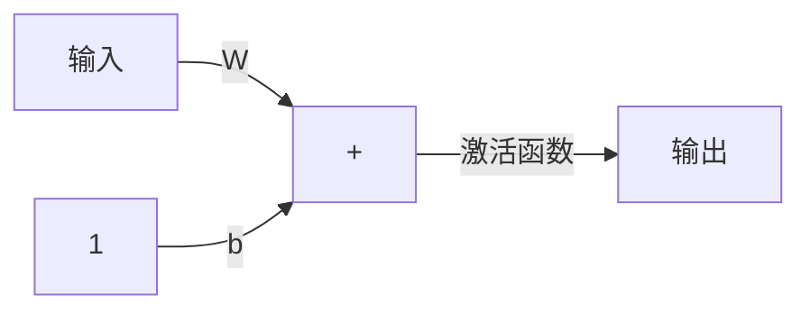

<head>
    

    
    
    
</head>

# 感知机学习规则

## 学习规则

### 有监督学习

在有监督学习当中，学习规则由一组描述网络行为的实例集合（训练集）给出：

{p1, t1}, {p2, t2},...,{pq, tq}

其中，pq为网络的输入，tq为响应的正确（目标）输出。当输入作用到网络时，网络的实际输出和目标相比较，然后学习规则调整网络的权值和偏置值。从而使得网络的实际输出越来越接近于目标输出。**感知机的学习规则就属于这一类有监督学习。**

### 增强学习

增强学习与有监督学习类似，只是他并不像有监督学习一样为每一个输入提供相应的目标输出，而仅仅给出一个级别。这个级别（或评分）是对网络在某些输入序列上的性能测度。这种类型的学习比监督学习少见。最为适合控制系统应用领域。

### 无监督学习

在无监督学习中，仅仅根据网络的输入调整网络的权值和偏置值，他没有输出目标。咋一看这种学习似乎并不可行：不知道网络的目标是什么，还能够训练网络吗？实际上，大多数这种算法都是为了完成聚类操作，学会将输入模式分为有限的几种类型。适合向量量化等应用问题。

## 感知机的结构

假设激活函数是hardlim（仅示例，更换激活函数不影响该网络能力），则该网络的输出公式为：

$$ a = hardlim(Wp+b) （式：1） $$

（式：1）在开发感知机的学习规则时十分有用，利用该公式可以方便地引用感知机网络输出中的单个元素。为此，权值矩阵：

$$ W = \begin{bmatrix}
     w_{1,1} & w_{1,2} & \dots & w_{1,R} \\
     w_{2,1} & w_{2,2} & \dots & w_{2,R} \\
     \vdots \\
     w_{S,1} & w_{S,2} & \dots & w_{S,R}
\end{bmatrix} $$

我们将构成 W 的第 i 个行向量定义为：

$$ i^W = \begin{bmatrix}
     w_{i,1}\\
     w_{i,2}\\
     \vdots\\
     w_{i,1R}
\end{bmatrix} $$

据此，将权值矩阵 W 重写为：

$$ W = \begin{bmatrix}
     1^{W^T}\\
     2^{W^T}\\
     \vdots\\
     S^{W^T}
\end{bmatrix} $$
