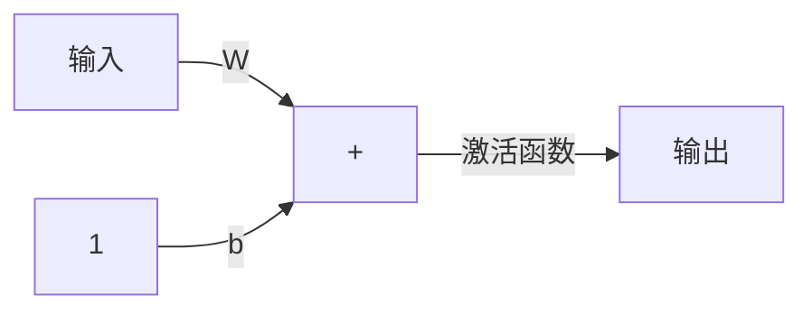

# 感知机学习规则

## 学习规则

### 有监督学习

在有监督学习当中，学习规则由一组描述网络行为的实例集合（训练集）给出：

{p1, t1}, {p2, t2},...,{pq, tq}

其中，pq为网络的输入，tq为响应的正确（目标）输出。当输入作用到网络时，网络的实际输出和目标相比较，然后学习规则调整网络的权值和偏置值。从而使得网络的实际输出越来越接近于目标输出。**感知机的学习规则就属于这一类有监督学习。**

### 增强学习

增强学习与有监督学习类似，只是他并不像有监督学习一样为每一个输入提供相应的目标输出，而仅仅给出一个级别。这个级别（或评分）是对网络在某些输入序列上的性能测度。这种类型的学习比监督学习少见。最为适合控制系统应用领域。

### 无监督学习

在无监督学习中，仅仅根据网络的输入调整网络的权值和偏置值，他没有输出目标。咋一看这种学习似乎并不可行：不知道网络的目标是什么，还能够训练网络吗？实际上，大多数这种算法都是为了完成聚类操作，学会将输入模式分为有限的几种类型。适合向量量化等应用问题。

## 感知机的结构

假设激活函数是hardlim（仅示例，更换激活函数不影响该网络能力），则该网络的输出公式为：

$$ a = hardlim(Wp+b) （式：1） $$

（式：1）在开发感知机的学习规则时十分有用，利用该公式可以方便地引用感知机网络输出中的单个元素。为此，权值矩阵：

$$ W = \begin{bmatrix}
     w_{1,1} & w_{1,2} & \dots & w_{1,R} \\
     w_{2,1} & w_{2,2} & \dots & w_{2,R} \\
     \vdots \\
     w_{S,1} & w_{S,2} & \dots & w_{S,R}
\end{bmatrix} $$

我们将构成 W 的第 i 个行向量定义为：

$$ i^W = \begin{bmatrix}
     w_{i,1}\\
     w_{i,2}\\
     \vdots\\
     w_{i,1R}
\end{bmatrix} $$

据此，将权值矩阵 W 重写为：

$$ W = \begin{bmatrix}
     1^{W^T}\\
     2^{W^T}\\
     \vdots\\
     S^{W^T}
\end{bmatrix} $$

这样就可以将网络输出向量的第 i 个元素写成

$$ a_i = hardlim(n_i) = hardlim(i^{W^T} p + b_i) $$

由于hardlim定义为：

$$ a = hardlim(n) = \left\{
\begin{aligned}
1, (n \geq 0) \\
0, (n < 0)
\end{aligned}
\right. $$

所以，如果权值矩阵的第 i 个行向量与输入向量的内积大于等于 -bi，该输出为1，否则该输出为0。因此，**网络中的每个神经元将输入空间划分为两个区域。**

### 算例

只考虑上述单神经元结构：

$$ a_i = hardlim(n_i) = hardlim(Wp + b) = hardlim(i^{W^T} p + b) = hardlim(w_{1,1} p_1 + (w_{1,2} p_2 + b)$$

假设

$$ w_{1,1} = 1, w_{1,2} = 1, b = -1$$

则决策边界为$ p_1 + p_2 - 1 = 0 $

若考虑多神经元感知机，则可以将输入分成许多类，每一类都由不同的输出向量表示。由于输出向量的每个元素可以取0和1，所以共有2的S次方种类别，S是神经元个数。

## 感知机的学习规则

由于感知机的学习规则是有监督学习的一个实例，所以，这里提供一组能够正确反映网络行为的实例：

{p1, t1}, {p2, t2},...,{pq, tq}

其中，pq为网络的输入，tq为响应的正确（目标）输出。当每个输入作用到网络上时，将网络的实际输出与目标做比较。然后学习规则调整该网络的权值和偏置值，使得网络的实际输出进一步靠近目标。

### 测试问题

在上述例子中，感知机的决策边界可以看作一条平面内直线。如果我们简化掉偏置值b，则决策边界为一条过原点的直线。为了保证简化后的网络仍能解决上述问题，则需找到一条新的决策边界来将输入分开。这样的边界有无数条。

给出这些决策边界的权值向量（与决策边界垂直），我们希望学习规则能够找到指向这些方向的一个权值向量。请注意权值向量的长度无关紧要，重要的是它的方向。

### 学习规则的构造

假设：

$$ \{p_1 = \begin{bmatrix} 1\\ 2 \end{bmatrix}, t_1=  1 \}, \{p_2 = \begin{bmatrix} -1\\ 2 \end{bmatrix}, t_2=  0 \}, \{p_3 = \begin{bmatrix} 0\\ -1 \end{bmatrix}, t_3=  0 \},$$

训练开始时，为网络的参数赋一些初始值。由于这里要训练的是一个两输入单输出的无偏置值网络，所以仅需对两个权值初始化。

$$ 1^{W^T} = [1.0 \quad -0.8] $$

现在将输入向量提供给网络。开始用p1送入：

$$ a = hardlim(1^{W^T} p_1) = hardlim([1.0 \quad -0.8] \begin{bmatrix} 1\\ 2 \end{bmatrix}) = hardlim(-0.6) = 0$$

由用例可知，网络输出值 0 和 t1 = 1 不一致，网络输出不正确。此时，决策边界初始的权值向量导致了对向量 p1 错误分类的决策边界。我么需要调整权值向量，使它更多的指向 p1，以便在后面更有可能获得正确的分类结果。

**一种**调整权值的方法是令$ 1^{W^T} $ 等于 $ p_1 $。这种简单的处理方法能确保问题可以正确的分类。然而，这种方法非常容易构造出一个并不能通过这种简单处理方法求解的问题。例如此时存在另一个 p 分类错误，如果每次都令$ 1^{W^T} $ 等于 p ，那么这两个输入向量必有一个被错误划分，于是**网络权值的求解过程将前后振荡，永远不能收敛得到正确的解**。

**另一种**调整方法是将 $ p_1 $ 加到$ 1^{W^T} $上。这样会使$ 1^{W^T} $的指向更加偏向$ p_1 $。重复这一操作，将使得$ 1^{W^T} $的指向逐步达到$ p_1 $的方向。这一规则可以表述为：

$$ 如果t = 1，且 a = 0，则 1^{W^{new}} = 1^{W^{old}} + p^T \quad （式：2） $$

在上述问题中应用这个规则，将会有新的$ 1^{W^T} $值：

$$ 1^{W^{new}} = 1^{W^{old}} + p_1^T = [1.0 \quad -0.8] + [1 \quad 2] = [2.0 \quad 1.2] $$

现在考虑另一个输入向量，并继续对权值进行调整。不断重复这一过程，直到所有输入向量被正确分类。

设下一个输入向量是 p2：

$$ a = hardlim(1^{W^T} p_2) = hardlim([2.0 \quad 1.2] \begin{bmatrix} -1\\ 2 \end{bmatrix}) = hardlim(0.4) = 1$$

p2的目标值是0，而该网络实际输出 a 是 1。所以一个属于类 0 的向量被错误划分到类 1 了。

既然现在的目标是将$ 1^{W^T} $从输入向量所指向的方向移开（t = 0），因此可以将（式：2）中的加法变减法：

$$ 如果t = 0，且 a = 1，则 1^{W^{new}} = 1^{W^{old}} - p^T \quad （式：3） $$

如果在上述问题中应用该规则：

$$ 1^{W^{new}} = 1^{W^{old}} - p_2^T = [2.0 \quad 1.2] - [-1 \quad 2] = [3.0 \quad -0.8] $$

现在将第三个向量p3送入该网络：

$$ a = hardlim(1^{W^T} p_3) = hardlim([3.0 \quad -0.8] \begin{bmatrix} 0\\ -1 \end{bmatrix}) = hardlim(0.8) = 1$$

可以看出这里形成的决策边界也错误划分了p3，这种情况下，再用（式：3）对网络进行修正：

$$ 1^{W^{new}} = 1^{W^{old}} - p_3^T = [3.0 \quad -0.8] - [0 \quad -1] = [3.0 \quad 0.2] $$

再次将向量p1，p2，p3分别送入网络：

$$ a = hardlim(1^{W^T} p_1) = hardlim([3.0 \quad 0.2] \begin{bmatrix} 1\\ 2 \end{bmatrix}) = hardlim(6.4) = 1$$

$$ a = hardlim(1^{W^T} p_2) = hardlim([3.0 \quad 0.2] \begin{bmatrix} -1\\ 2 \end{bmatrix}) = hardlim(-2.6) = 0$$

$$ a = hardlim(1^{W^T} p_3) = hardlim([3.0 \quad 0.2] \begin{bmatrix} 0\\ -1 \end{bmatrix}) = hardlim(-0.2) = 0$$

可以看到，该感知机能够对上述三个输入向量进行正确分类。

据此，我们可以得到第三条也就是最后一条规则：

$$ 如果t=a，则 1^{W^{new}} = 1^{W^{old}}$$

即，正确工作不改变权值。

### 统一的学习规则

将之前总结的三个式子整理：

令 e = t - a，则可以得到：

$$ 如果e = 1，则 1^{W^{new}} = 1^{W^{old}} + p^T $$

$$ 如果e = -1，则 1^{W^{new}} = 1^{W^{old}} - p^T $$

$$ 如果 e = 0，则 1^{W^{new}} = 1^{W^{old}}$$

进一步观察发现误差 e 的符号和 p 的符号一致，则可进一步统一为：

$$ 1^{W^{new}} = 1^{W^{old}} + e p^T = 1^{W^{old}} + (t - a) p^T \quad （式：4） $$

我们也可以将此规则扩展到偏置值的训练过程当中：可以将偏置值看作是一个输入总是 1 的权值即可。于是可以将（式：4）中的p用偏置值的输入 1 来替换，可以得到感知机偏置值的学习规则：

$$ b^{new} = b^{old} + e $$
