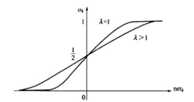

# 监督学习神经网络

感知机神经网络是一种典型的前馈神经网络，具有分层结构，信息冲输入层进入网络，逐层向前传递至输出层。根据感知机神经元激活函数、隐层数以及权值调整规则的不同，可以形成具有各种功能特点的神经网络。

## 单层感知机

由美国心理学家提出的一种具有单层计算单元的神经网络，称为Perceptron，即感知机。感知机模拟人的视觉接受环境信息，并由神经冲动进行信息传递。感知机研究中首次提出了自组织、自学习的思想，而且对所能解决的问题存在这收敛算法，并能从数学上严格证明。

### 感知机模型

单层感知机是指只有一层处理单元的感知机，包括输入层在内，应为两层。其拓扑结构如图所示：

途中输入层也成为感知层，有 n 个神经元节点，这些节点只负责引入外部信息，自身无信息处理能力，每个节点接收一个输入信号，n 个输入信号构成输入向量 X。输出层又 m 个神经元节点，每个节点均有信息处理能力，m 个节点向外部输出处理信息，构成输出向量 O。两城之间的连接权值用 $ W_j $ 表示，m 个权向量构成单层感知机的权值矩阵 W。

其净输入为：$ net_j = W^T X $

激活函数一般采用符号函数，则输出为：

$$ O = sgn(W^T X) $$

### 单节点感知机的功能分析

为了方便分析，只考虑上图中感知机的情况。可以看出，单节点感知机实际上就是一个 M-P 神经元模型，由于采用了符号激活函数，则输出可进一步表达为：

$$ o_j = \left\{
\begin{aligned}
1  (W_j^T > 0) \\
-1(0)  (W_j^T < 0)
\end{aligned}
\right. $$

下面分三种情况讨论单计算节点感知机的功能。

（1）设输入向量 $ X = (x_1, x_2)^T $，则两个输入分量在几何上构成一个二维平面，输入样本可以用该平面上的一个点表示。节点 j 的输出为：

$$ o_j = \left\{
\begin{aligned}
1  (w_{1j}x_1 + w_{2j}x_2 - T_j > 0) \\
-1 (w_{1j}x_1 + w_{2j}x_2 - T_j < 0)
\end{aligned}
\right. $$

则由以下方程确定的直线成为二维输入样本空间上的一条分界线：

$$ w_{1j}x_1 + w_{2j}x_2 - T_j = 0 $$

线上方的样本用点表示，它们使得 $ net_j > 0 $，从而使输出为1；线下方的样本用空心圆表示，它们使得 $ net_j <> 0 $，从而使输出为-1；显然感知机权值和阈值确定的直线方程规定了分界线在样本空间的位置，从而也体现了如何将输入样本分为两类的分类知识与确定规则。假设分界线的初始位置不能将两类样本正确分开，改变权值和阈值，分界线也会随之改变，因此总可以将其调整到正确的分类位置。

（2）将上述结论推广到三维，设输入向量 $ X = (x_1, x_2, x_3)^T $ ，则三个输入分量在几何上构成一个三维空间。节点 j 的输出为：

$$ o_j = \left\{
\begin{aligned}
1  (w_{1j}x_1 + w_{2j}x_2 + w_{3j}x_3 - T_j > 0) \\
-1 (w_{1j}x_1 + w_{2j}x_2 + w_{3j}x_3 - T_j < 0)
\end{aligned}
\right. $$

则由以下方程确定的平面成为三维输入样本空间上的一个分界平面：

$$ w_{1j}x_1 + w_{2j}x_2 + w_{3j}x_3 - T_j = 0 $$

平面上方的样本用点表示，它们使得 $ net_j > 0 $，从而使输出为1；平面下方的样本用空心圆表示，它们使得 $ net_j <> 0 $，从而使输出为-1；显然感知机权值和阈值确定的平面方程规定了分界平面在样本空间的位置，从而也体现了如何将输入样本分为两类的分类知识与确定规则。假设分界平面的初始位置不能将两类样本正确分开，改变权值和阈值，分界平面也会随之改变，因此总可以将其调整到正确的分类位置。

（3）将上述特例推广到 n 维输入空间的一般情况，设输入向量 $ X = (x_1, x_2, x_3, \dots, x_n)^T $ ，则 n 个输入分量在几何上构成一个 n 维空间。由以下方程确定的超平面成为 n 维输入样本空间上的一个分界超平面：

$$ w_{1j}x_1 + w_{2j}x_2 + w_{3j}x_3 + \dots + w_{nj}x_n - T_j = 0 $$

此平面可以将输入样本分为两类。

通过以上分析可以看出，一个最简单的计算节点感知机具有分类功能。其分类原理是将分类知识储存于感知机的权向量（包含阈值）中，由权向量确定的分类平面将输入模式分为两类。

下面研究单计算节点感知机实现逻辑运算的问题。

首先，用感知机实现逻辑“与”功能。逻辑“与”的真值表及感知机结构如下：

$ x_1 $ | $ x_2 $ | $ y $
- | - | -
0 | 0 | 0
0 | 1 | 0
1 | 0 | 0
1 | 1 | 1

从真值表可以看出，4个样本输出有两种情况，一种使输出为0，另一种使输出为1，因此属于分类问题。用感知机学习规则进行训练，得到的连接权值标注在在下图：

令净输入为0，可以得到分类决策方程：

$$ 0.5x_1 + 0.5x_2 - 0.75 = 0 $$

并且该方程并不是唯一的决策方程。

同理，用感知机实现逻辑“或”功能。逻辑“或”的真值表及感知机结构如下：

$ x_1 $ | $ x_2 $ | $ y $
- | - | -
0 | 0 | 0
0 | 1 | 1
1 | 0 | 1
1 | 1 | 1

从真值表可以看出，4个样本的输出也分为两类，一种使输出为0，另一种使输出为1，因此属于分类问题，训练后可以的到连接权值： $ w_1 = w_2 = 1, T = -0.5 $ ，令净输入为0，则得到决策方程：

$$ x_1 + x_2 + 0.5 = 0 $$

显然，该直线也并非唯一解。

### 感知机的局限性以及解决途径

在上面两个例子中，说明单计算节点感知机可具有逻辑“与”和逻辑“或”的功能。那么它是否也具有“异或”的功能呢？

异或真值表：

$ x_1 $ | $ x_2 $ | $ y $
- | - | -
0 | 0 | 0
0 | 1 | 1
1 | 0 | 1
1 | 1 | 0

表中的四个样本也分为两类，但是把他们放到平面直接坐标系可以发现，任何直线也不能将两类样本分开。

如果两类样本可以用直线、平面或者超平面分开，成为线性可分，否者线性不可分。由感知机的几何意义可知，由于净值输入为0确定的决策边界方程是线性方程，因而他只能解决线性可分性问题而不可能解决线性不可分问题。由此可知，单层感知机的局限是：仅对线性可分问题具有分类能力。

解决方法：

在输入层和输出层之间引入隐层作为输入模式的“内部表示”，将单层感知机变成多层感知机。

示例：

根据上图给出一个单隐层的感知机，其中隐层的两个节点相当于两个独立的符号单元（单计算节点感知机）。根据之前的魔术，这两个符号单元可以分别在 $ x_1 - x_2 $ 平面上确定一条分解直线 $ S_1 $ 和 $ S_2 $ ，从而构成如下图所示的开放式凸域。显然，通过适当的调节两条直线的位置，可以使两类线性不可分问题分别位于该开放式凸域的内部和外部。因此对隐节点1来说，直线 $ S_1 $ 下面的样本使其输出为 $ y_1 = 1 $ ，而直线上方的样本示器输出为 $ y_1 = 0 $ ；对隐节点2来说，直线 $ S_1 $ 上面的样本示器输出为 $ y_2 = 1 $ ，而直线下面的样本示器输出为 $ y_2 = 0 $ 。

当输入样本为空心圆类时，其位置出于开放式凸域的内部，即处在 $ S_1 $ 下方和 $ S_2 $ 的上方。根据以上分析，$ y_1 = 1, y_2 = 1 $。

当输入样本为点类时，其位置出于开放式凸域的外部，即处在 $ S_1 $ 和 $ S_2 $ 的上方或下方。根据以上分析，$ y_1 = 0, y_2 = 1 或 y_1 = 1, y_2 = 0 $。

输出层节点以隐层两节点的输出作为输入，其结构也相当于一个符号单元。如果经过悬链，示器具有逻辑“与非”功能，则异或问题可以得到解决。

异或感知机结构

样本 | $ x_1 $ | $ x_2 $ | $ y_1 $ | $ y_2 $ | $ o $
- | - | - | - | - | -
$ X^1 $ | 0 | 0 | 1 | 1 | 0
$ X^2 $ | 0 | 1 | 0 | 1 | 1
$ X^3 $ | 1 | 0 | 1 | 0 | 1
$ X^4 $ | 1 | 1 | 1 | 1 | 0

根据感知机原理，不难想象，放输入样本为二位向量时，隐层中每个节点确定了二维平面的一条分解直线。多条直线经输出节点组合后构成各种形状的凸域。通过训练凸域的形状，可将两类线性不可分样本分为域外和域内。输出层节点负责将与内外的两类样本进行分类。

当单隐层感知机具有多个节点时，节点的数量增加可以使多边形凸域边数增加，从而在输入空间构建出任意形状的凸域。如果再次基础上增加一层，成为第二个隐层，则该层的每个节点确定一个凸域，各个凸域经输出层节点组合后可以成为任意形状域。组合后，分类能力比单隐层大大提升。分类问题越复杂，不同类样本在样本空间的布局越趋于交错分布，因而隐层需要的节点神经元点数也越多。

理论表明：双隐层感知机足以解决任意复杂度的分类问题（该结论已经过严格的数学证明）。

为了便于直观描述感知机的分类能力，之前的分析中都是用符号函数（或单位阶跃函数）作为激活函数。实际上，提高感知机分类能力的另一个途径是，采用非线性连续函数作为神经元节点的激活函数。这样做的好处是能使决策边界的基本线素由直线变成曲线，从而使整个边界线变为连续光滑的曲线。

关于感知机中增加隐层后可以解决非线性可分问题，也可以从非线性映射的角度来理解。若将上表中的数据点分别放置在由 $ x_1-x_2 $ 构成的输入空间以及由 $ y_1-y_2 $ 构成的隐空间，可以看出由于样本  和  被映射到隐空间的同一位置，从而使得在输入空间非线性可分的 4 个样本点映射到隐空间后为线性可分，因而由输出层节点确定分类决策边界可将映射到隐空间的两类样本分开。

简单的感知机只能且介先行问题，能够求解非线性问题的网络应具有隐层，但但与各隐层节点来说，没有期望输出，则之前介绍的规则——权值调整量取决于感知机期望输出与实际输出只差，对于隐层权值不适用。

含有隐层的多层感知机能大大提升网络分类能力，但是由于没有期望输出，导致之前的学习规则不适用。后来由众多科学家研究，对具有非线性连续激活函数的多层感知机的误差反向传播（error back proragation，简称BP）算法进行了详尽的分析，实现了多层网络的设想。由于多层感知机的训练经常采用误差反向传播算法，人们也经常吧多层感知机直接称为 BP 网络。

## BP神经网络

BP 算法的基本思想是：学习过程由信号正向传播与误差反向传播两个过程组成，正向传播时，输入样本从输入层传入，经各隐层逐层处理后，传向输出层。若输出层的实际输出与期望的输出不符，则转入误差的反向传播阶段。误差反向传播是将输出误差以某种形式通过隐层向输入层逐层反传，并将误差分摊给各层的所有单元，从而获得各层单元的误差信号，此误差信号即作为修正各单元权值的依据。这种信号正向传播与误差反向传播的各层权值调整过程是周而复始地进行的。权值不断调整的过程，也就是网络的学习训练过程。此过程一直进行到网络输出的误差减少到可见收的程度，或进行到预先设定的学习次数为止。

### BP网络模型

采用 BP 算法的多层感知机是迄今为止应用最广泛的神经网络，在多层感知机的应用中，以单隐层感知机最为普遍。一般称之为三层感知机，所谓三层：输入层、隐层、输出层。

三层感知机中，输入向量 $ X = (x_1, x_2, \dots, x_i, \dots, x_n)^T $ ，其中 $ x_0 = -1 $ 是为隐层神经元引入阈值而设置的；隐层输出向量 $ Y = (y_1, y_2, \dots, y_j, \dots, y_m)^T $ ，其中 $ y_0 = -1 $ 是为输出层神经元引入阈值而设置的；输出层输出的向量为 $ O = (o_1, o_2, \dots, o_k, \dots, o_l)^T $ ；期望输出向量 $ d = (d_1, d_2, \dots, d_k, \dots, d_l)^T $ 。输入层到隐层之间的权值矩阵用 V 表示，$ V = (V_1, V_2, \dots, V_j, \dots, V_m)^T $  ，其中列向量 $ V_j $ 为隐层第 j 个神经元对应的权向量；隐层到输出层之间的权值矩阵用 W 表示， $ W = (W_1, W_2, \dots, W_k, \dots, W_i)^T $ ，其中列向量 $ W_k $ 为输出层第 k 个神经元对应的权向量。

对于输出层，有：

$$ o_k = f(net_k) \quad k = 1,2,\dots,l $$

$$ net_k = \sum_{j = 0}^m w_{jk} y_j \quad k = 1,2,\dots,l $$

对于隐层，有：

$$ y_j = f(net_j) \quad j = 1,2,\dots,m $$

$$ net_j = \sum_{i = 0}^n v_{ij} x_i \quad j = 1,2,\dots,m $$

以上两式中，激活函数 f(x) 均为单极性 Sigmoid 函数：

$$ f(x) = \frac{1}{1+e^{-x}} $$

f(x)具有连续、可导的特点，且有：

$$ f'(x) = f(x)[1-f(x)] $$

根据需要也可以采用双极性的 Sigmoid 函数：

$$ f(x) = \frac{1-e^{-x}}{1+e^{-x}} $$

### BP学习算法

以下将以三层感知机为例介绍 BP 学习算法，然后推广到一般多层感知机。

#### 网络误差定义和权值调整思路

当网络输出与期望输出不等时，存在输出误差 E，定义如下：

$$ E = \frac{1}{2}(d-O)^2 = \frac{1}{2}\sum_{k=1}^l (d_k - o_k)^2 $$

将以上误差定义式展开到隐层，有：

$$ E = \frac{1}{2}\sum_{k=1}^l [d_k - f(net_k)]^2 = \frac{1}{2}\sum_{k=1}^l [d_k - f(\sum_{j=0}^m w_{jk} y_i)]^2 $$

进一步展开到输出层，有：

$$ E = \frac{1}{2}\sum_{k=1}^l \{d_k - f[\sum_{j=0}^m w_{jk} f(net_j)]\}^2 =  \frac{1}{2}\sum_{k=1}^l \{d_k - f[\sum_{j=0}^m w_{jk} f(\sum_{j=0}^m v_{ij} x_i)]\}^2 $$

由上式可以看出，网络误差是各层权值 $ w_{jk}, v_{ij} $ 的函数，因此调整权值可以改变误差 E （从最小化损失函数的角度看，损失函数也称为目标函数或者代价函数）。

显然，调整权值的原则是使误差不断的减少，因此应使权值的调整量与误差的梯度下降成正比，即：

$$ \Delta w_{jk} = -\eta \frac{\partial E}{\partial w_{jk}} \quad j=0,1,2,\dots,m;k=1,2,\dots,l $$

$$ \Delta v_{ij} = -\eta \frac{\partial E}{\partial v_{ij}} \quad i=0,1,2,\dots,n;j=1,2,\dots,m $$

式中，符号表示梯度下降，常数 $ \eta \in (0, 1) $ 表示比例系数，在训练中反映了学习率。可以看出，BP算法属于 $ \delta $ 学习规则类，这类算法常被称为误差的梯度下降算法。

#### BP算法的推导

上述两式，进士对权值调整思路的数学表达，而不是具体权值调整计算式。下面我们推导三层 BP 算法权值调整计算式。事先约定，在全部推导过程中，对输出层均有 $ j = 0,1,2,\dots,m; k = 1,2,\dots,l $ ；对隐层均有 $ i = 0,1,2,\dots,n; j = 1,2,\dots,m $ 。

对于输出层：

$$ \Delta w_{jk} = -\eta \frac{\partial E}{\partial w_{jk}} = -\eta \frac{\partial E}{\partial net_k} \frac{\partial net_k}{\partial w_{jk}} $$

对于隐层：

$$ \Delta v_{ij} = -\eta \frac{\partial E}{\partial v_{ij}} = -\eta \frac{\partial E}{\partial net_j} \frac{\partial net_j}{\partial v_{ij}} $$

对输入层和隐层各定义一个误差信号，令：

$$ \delta_k^o = - \frac{\partial E}{\partial net_k} $$

$$ \delta_j^y = - \frac{\partial E}{\partial net_j} $$

综合上述式子：

$$ \Delta w_{jk} = \eta \delta_k^o y_j $$

$$ \Delta v_{ij} = \eta \delta_j^y x_i $$

乐意看出，只要计算出误差信号，权值调整量的计算推导即可完成。

继续推导如何求误差信号：

对于输出层， $ \delta_k^o $ 可展开为：

$$ \delta_k^o = -\frac{\partial E}{\partial net_k} = -\frac{\partial E}{\partial o_k} \frac{\partial o_k}{\partial net_k} = -\frac{\partial E}{\partial o_k}f'(net_k) $$

对于隐层，  可展开为：

$$ \delta_j^y = - \frac{\partial E}{\partial net_j} = -\frac{\partial E}{\partial y_j} \frac{\partial y_j}{\partial net_j} = -\frac{\partial E}{\partial y_j}f'(net_j) $$

下面求上式中网络误差对各层输出的偏导。

对于输出层，利用误差定义可得：

$$ \frac{\partial E}{\partial o_k} = -(d_k - o_k) $$

对于隐层，利用误差在隐层的展开式可得：

$$ \frac{\partial E}{\partial y_j} = - \sum_{k=1}^l (d_k - o_k)f'(net_k)w_{jk} $$

将上述结果带入 $ \delta_k^o, \delta_j^y $ ，并利用激活函数 $ f'(x) = f(x) [1-f(x)] $ 的性质可得：

至此，两个误差信号的推导已完成，得到三层感知机的 BP 学习算法权值调整公式为：

$$ \left\{
\begin{aligned}
\Delta w_{jk} = \eta \delta_k^o y_j = \eta(d_k - o_k) o_k (1 - o_k) y_i \\
\Delta v_{ij} = \eta \delta_j^y x_i = \eta (\sum_{k=1}^l \delta_k^o w_{jk}) y_j (1 - y_j) x_i
\end{aligned}
\right. $$

对于多层感知机，设共有 h 个隐层，按前向顺序各隐层节点数分别记为 $ m_1,m_2,\dots,m_h $ ，各隐层输出分别记为 $ y^1,y^2,\dots,y^h $ ，各隐层权值矩阵分别记为 $ W^1,W^2,\dots,W^h,W^{h+1} $ ，则各层权值调整公式为：

输出层：

$$ \Delta w_{jk}^{h+1} = \eta \delta_k^{h+1} y_j^h = \eta(d_k - o_k) o_k (1-o_k)y_j^h \quad j=0,1,2,\dots,m_h;k=1,2,\dots,l $$

第 h 隐层：

$$ \Delta w_{ij}^h = \eta \delta_j^h y^{h-1} = \eta (\sum_{k=1}^l \delta_k^o w_{jk}^{h+1}) y_j^h (1 - y_j^h) y_j^{h-1} \quad i=0,1,2,\dots,m_{h-1};j=1,2,\dots,m_h $$

按以上规律逐层类推，则第一隐层权值调整计算公式：

$$ \Delta w_{pq}^1 = \eta \delta_q^1 y^1 = \eta (\sum_{r=1}^{m_2} \delta_r^2 w_{qr}^2) y_q^1 (1 - y_q^1) x_p \quad p=0,1,2,\dots,n;q=1,2,\dots,m_1 $$

三层感知机的 BP 学习算法也可以写成向量形式。

对于输出层，设 $ Y=(y_0,y_1,dots,y_m)^T, \delta^o=(\delta_1^o,\delta_2^o,dots,\delta_k^o,\dots,\delta_l^o)^T $ ，则：

$$ \Delta W = \eta (\delta^o Y^T)^T $$

对于隐层，设 $ X=(x_0,x_1,dots,x_i,\dots,x_n)^T, \delta^y=(\delta_1^y,\delta_2^y,dots,\delta_j^y,\dots,\delta_m^y)^T $ ，则：

$$ \Delta V = \eta (\delta^y X^T)^T $$

容易看出，BP学习算法中，各层权值调整公式形式上都是一样的，均有3个因素决定，即：学习率 $ \eta $ 、本层输出的误差信号 $ \delta $ 以及本层输入信号 $ Y(或X) $ 。其中输出层误差信号与网络的期望输出和实际输出之差有关，直接反映了误差，而各隐层的误差信号与前面各层误差信号都有关，是从输出层开始逐层反传过来的。

#### BP 算法的信号流向

如上图，BP算法的特点是信号的向前计算和误差的反向传播。

由图中可以看出，向前的过程是：输入信号 X 从输入层进入后，通过各隐层节点的内星权向量 V 的到该层的输出信号 Y；该信号向前输入到输出层，通过其各节点内星权向量 W 得到该层的输出 O。反向的过程是：在输出层期望输出 d 与实际输出 O 相比较得到误差信号 $ \delta^o $ ，由此可计算出输出层权值的调整量；误差信号 $ \delta^o $ 通过隐层各节点的外星向量反传至隐层各节点，得到隐层的误差信号 $ \delta^y $ ，由此可计算出隐层权值的调整量。

### BP网络的主要能力

（1）非线性映射能力

BP网络能学习和存储大量输入-输出模式的映射关系，而无需实现了解这种映射关系的数学方程。只要能提供足够多的样本模式对供 BP 网络进行学习训练，它便能完成由 n 维输入空间到 m 维输出空间的非线性映射。

在工程上及许多技术领域中经常会遇到这样的问题：对某输入-输出系统已积累了大量的相关的输入-输出数据，但对其内部蕴含的规律仍未掌握，无法用数学方法描述。这一类问题的共同特点：难以得到解析解、缺乏专家经验、能够表示和转化为模式识别或非线性映射问题。对于这类问题，多层感知机具有无可比拟的优势。

（2）泛化能力

BP网络训练后将所提取的样本对中的非线性映射关系存储在权值矩阵中，在其后的工作阶段，当向网络输入训练时未曾见过的非样本数据时，网络也能完成由输入空间到输出空间的正确映射。这种能=能力称为多层感知机的泛化能力，它是衡量多层感知机的一个重要方面。

（3）容错能力

BP网络的有点还在于，允许输入样本中带有较大的误差甚至个别错误。因为对权值矩阵的调整过程也是从大量样本中提取统计特性的过程，反映正确规律的知识来自全样本。个别样本中的误差不能左右对权值矩阵的调整。

### 误差曲面与BP算法的局限性

BP网络的误差是各层权值和输入样本对的函数，因此可以表达为：

$$ E = F(X^p, W, V, d^p) $$

所以，误差 E 是 n + 1 维上极为复杂的曲面，该曲面上每个点的“高度”对应一个误差值。可以想象到误差曲面的分布具有以下两个特点：

（1）存在平坦区域

误差曲面上有些区域比较平坦，在这些区域中，误差的梯度变化的比较小，计师权值的调整量很大，误差仍然下降缓慢。造成这种情况的原因与各节点的净输入过大有关。

BP算法是严格遵从误差梯度下降的原则调整权值，训练进入平坦区后，尽管实际输出与期望输出仍然误差很大，但是由于误差梯度小而使得权值调整力度减小，训练只能以增加迭代次数为代价缓慢进行。只要调整的方向正确，调整的时间足够长，总可以退出平坦区而进入某个谷点。

（2）存在多个极小值

二维权空间的误差曲线像一片连绵起伏的山脉，其低凹的部分就是误差函数的极小点。可以想象，高维权空间的误差曲面“山势”更加复杂，因而会有更多的极小点。多数极小点都是局部极小，即使是全局极小往往也不是唯一的，其特点是误差梯度为零。误差曲面的这一特点使得以误差梯度下降为权值调整依据的BP算法无法辨别极小点的性质，因而常常陷入某个局部最小无法自拔。

误差曲面的平坦区域会使训练次数大大增加，从而影响了收敛的速度；而误差曲面的多极小值点会使训练陷入局部极小值，从而使得训练无法收敛于给定的误差。以上两个问题都是BP算法固有的缺陷，其根源在于基于误差梯度下降的权值调整原则要求每一步的求解都取局部最优（该调整原则即所谓贪心算法原则）。此外，对于复杂的多层感知机，标准BP算法能否收敛是无法预测的，因为训练最终进入局部极小值还是全局极小值与网络的初始状态有关，而初始状态是随机确定的。

## BP算法改进

将BP算法用于具有非线性激活函数的三层感知机，可以以任意精度通近任何非线性函数，这一非凡优势使多层感知机得到越来越广泛的应用。然而标准的BP算法在应用中暴露BP出不少内在的缺陷：

（1）容易形成局部极小而得不到全局最优；
（2）训练次数多，使得学习效率低，收敛速度慢；
（1）隐节点的选取缺乏理论指导；
（1）训练时学习新样本有遗忘旧样本的趋势。

针对上述问题，国内外已提出不少有效的改进算法。

### 增加动置项

标准BP算法在调整权值时，只按t时刻误差的梯度降方向调整，而没有考虑t时刻以前的梯度方向，从而常使训练过程发生振荡，收敛缓慢。为了提高网络的训练速度，可以在权值调整公式中增加一动量项。若用W代表某层权矩阵，X代表
某层输入向最，则含有动量项的权值调整向量表达式为：

$$ \Delta (t) = \eta \delta X + \alpha \Delta W(t-1) $$

可以看出，增加动量项即从前一次权值调整量中取出一部分迭加到本次权值调整量中。 $ \alpha $ 称为动量系数，一般有 $ \alpha \in (0, 1) $ 。动量项反映了以前积累的调整经验。对于t时刻的调整起阻尼作用。当误差曲面出现骤然起伏时，可减小振蓰趋势，提离训练速度。目前，BP算法中都增加了动量项，以至于有动量项的BP算法成为一种新的标准算法。

### 自适应学习率

学习率 $ \eta $ 也称为步长，在标准BP算法中定为常数，然而在实际应用中，很难确定一个从始至终都合适的最佳学习率。从误差曲面可以看出，在平坦区域内 $ \eta $ 太小会使训练次数增加，因而希望增大 $ \eta $ 值；而在误差变化剧烈的区域， $ \eta $ 太大会因调整量过大而跨过较窄的“凹坑”处，使训练出现振荡，反而使迭代次数增加。为了加速收敛过程，一个较好的思路是自适应改变学习率，使其该大时增大.该小时减小。

改变学习率的办法很多，其目的都是使其在整个训练过程中得到合理调节。这里介绍其中一种方法：

设一初始学习率，若经过一批次权值调整后使总误差 $ E_总 $ 上升，则本次调整无效，且 $ \eta(t+1) = \beta \eta(t) (\beta < 1) $ ，若经过一批次权值调整后使总误差 $ E_总 $ 下降，则本次调整有效，且 $ \eta(t+1) = \theta \eta(t) (\theta > 1) $ 。

### 引入陡度因子

前面的分析指出，误差曲面上存在着平坦冈域。权值调整进入平坦区的原因是神经元输出进入了激活函数的饱和区，如果在调整进入平坦区后，设法压缩神经元的净输入，使其输出退出激活函数的饱和区，就可以改变误差函数的形状，从而使调整脱离平坦区。实现这一思路的具体做法是，在原激活函数中引人一个陡度因子 $ \lambda $ :

$$ o_k = \frac{1}{1 + e^{-net_k / \lambda}} $$

当发现 $ \Delta E $ 接近零而 $ d_k - o_k $ 仍较大时，可判断已进人平坦区，此时令 $ \lambda > 1 $ ；当退出平坦区后，再令 $ \lambda = 1$ ，从下图可以看出，当 $ \lambda > 1 $ 时， $ net_k $ 坐标压缩了 $ \lambda $ 倍，神经元的激活函数曲线的敏感区段变长，从而可使绝对值较大的 $ net_k $ 退出饱和值。当 $ \lambda = 1 $ 时，激活函数恢复原状，对较小的 $ net_k $ 具有较高的灵敏度。应用结果表明该方法对于提高BP算法的收敛速度十分有效。

## BP网络设计基础

尽管神经网络的研究与应用已经取得巨大的成功，但是在网络的开发设计方面至今还没有一套完善的理论作为指导。应用中采用的主要设计方法是，在充分了解待解决问题的基础上将经验与试探相结合，通过多次改进性试验，最终选出一个较好的设计方案。许多人原以为只要掌握了几种神经网络的结构和算法，就能直接应用了，但真正用神经网络解决问题时才会发现，应用原来不是那么简单。作为参考下面介绍多层感知器开发设计中常用的基本方法与实用技术，其中关于数据准备等内容设计的原则与方法也适合于后面将要介绍的其他网络。

### 网络信息容量与训练样本

多层感知器的分类能力与网络信息容量相关。如用网络的权值和阈值总数 $ n_w $ 表征网络信息容量，研究表明，训练样本数 P 与给定的训练误差 $ \epsilon $ 之间应满足以下匹配关系:

$$ P \approx \frac{n_w}{\epsilon} $$

上式表明，网络的信息容量与训练样本数之间存在着合理匹配关系。在解决实际问题时，训练样本数常常难以满足以上要求。对于确定的样本数，网络参数太少则不足以表达样本中蕴涵的全部规律，而网络参数太多则由于样本信息少而得不到充分训练。因此，当实际问题不能提供较多的训练样本时，必须设法减少样本维数，从而降低 $ n_w $。

### 训练样本的准备

训练数据的准备工作是网络设计与训练的基础，数据选择的科学合理性以及数据表示的合理性对于网络设计具有极为重要的影响。数据准备包括原始数据的收集、数据分析、变量选择和数据预处理等诸多步骤，下面分几个方面介绍有关的知识:

#### 输入输出量的选择

一个待建模系统的输入-输出就是神经网络的输入输出变量。这些变量可能是事先确定的，也可能不够明确，需要进行一番筛选。一般来讲，输出量代表系统要实现的功能目标，其选择确定相对容易一些，例如系统的性能指标、分类问题的类别归属或非线性函数的函数值等。输入量必须选择那些对输出影响大且能够检测或提取的变量，此外还要求各输入变量之间互不相关或相关性很小，这是输入量选择的两条基本原则。如果对某个变量是否适合作网络输入没有把握，可分别训练含有和不含有该输入的两个网络，对其效果进行对比。

从输入、输出量的性质来看，可分为两类:一类是数值变量;一类是语言变量。数值变量的值是数值确定的连续量或离散量。语言变量是用自然语言表示的概念，其“语言值”是用自然语言表示的事物的各种属性。例如，颜色、性别、规模等都是语言变量，其语言值可分别取为红、绿、蓝，男、女，大、中、小等。当选用语言变量作为网络的输入或输出变量时，需将其语言值转换为离散的数值量。

#### 输入量的提取与表示

很多情况下，神经网络的输入量无法直接获得，常常需要用信号处理与特征提取技术从原始数据中提取能反映其特征的若干特征参数作为网络的输入。提取的方法与待解决的问题密切相关，下面仅讨论几种典型的情况：

（1）文字符号输入 在各类字符识别的应用中，均以字符为输入的原始对象。BP 网络的输入层不能直接接受字符输入，必须先对其进行编码，变成网络可接受的形式。

（2）曲线输入 多层感知器在模式识别类应用中常被用来识别各种设备输出的波形曲线，对于这类输入模式，常用的表示方法是提取波形在各区间分界点的值，以其作为网络输入向量的分量值。各输入分量的下标表示输入值在波形中的位置，因此分量的编号是严格有序的。

（3）函数自变量输入 用多层感知器建立系统的数学模型属于典型的非线性映射问题。一般当系统已有大量输入-输出数据对，建模的目的是提取其中隐含的映射规则(即函数关系)。这类应用的输入表示比较简单，一般有几个输入量就设几个分量，一个输入分量对应个输入层节点。

（4）图像输入 当需要对物体的图像进行识别时，很少直接将每个像素点的灰度值作为网络的输入。因为图像的像素点常数以万计，不适合作为网络的输入，而且难以从中提取有价值的输入-输出规律。在这类应用中，一般先根据识别的具体目的从图像中提取一些有用的特征参数，再根据这些参数对输入的贡献进行筛选，这种特征提取属于图像分析的范畴。

#### 输出量的表示

所谓输出量实际上是指为网络训练提供的期望输出，一个网络可以有多个输出变量，其表示方法通常比输入量容易得多，而且对网络的精度和训练时间影响也不大。输出量可以是数值变量，也可以是语言变量。对于数值类的输出量，可直接用数值量来表示，但由于网络实际输出只能是0~1或-1~1之间的数，所以需要将期望输出进行尺度变换处理，有关的方法在样本的预处理中介绍。下面介绍几种语言变量的表示方法:

（1）“n中取1”表示法 分类问题的输出变量多用语言变量类型，如质量可分为优良、中、差4个类别。“n中取1”是令输出向量的分量数等于类别数，输入样本被判为哪类，对应的输出分量取1，其余n-1个分量全取0。例如，用0001、0010、0100和1000分别表示优、良、中、差4个类别。这种方法的优点是比较直观，当分类的类别数不是太多时经常采用。

（2）“n-1”表示法 上述方法中没有用到编码全为0的情况，如果用n-1个全为0的输出向量表示某个类别，则可以节省一个输出节点。如上面提到的4个类别也可以用000、001、010和100表示。特别是当输出只有两种可能时，只用一个二进制数便可以表达清楚。如用0和1代表性别的男和女，考察结果的合格与不合格，性能的好和差等。

（3）数值表示法 二值分类只适于表示两类对立的分类，而对于有些渐进式的分类，可以将语言值转化为二值之间的数值表示。例如，质量的差与好可以用0和1表示，而较差和较好这样的渐进类别可用0和1之间的数值表示，如用0.25表示较差、0.5表示中等、0.75表示较好等。数值的选择要注意保持由小到大的渐进关系，并要根据实际意义拉开距离。

#### 输入输出数据的预处理

（1）尺度变换 尺度变换也称归一化或标准化，是指通过变换处理将网络的输入、输出数据限制在 [0, 1] 或 [-1, 1] 区间内。进行尺度变换的主要原因有:

①网络的各个输入数据常常具有不同的物理意义和不同的量纲，如某输入分量在 $ 0 — 10^{5} $ 范围内变化，而另输入分量则在 $ 0 — 10^{-5} $ 范围内变化。尺度变换使所有分量都在 [0, 1] 或 [-1, 1] 之间变化，从而使网络训练一开始就给各输入分量以同等重要的地位;

②BP网的神经元均采用Sigmoid转移函数，变换后可防止因净输入的绝对值过大而使神经元输出饱和，继而使权值调整进入误差曲面的平坦区;

③ sigmoid转移函数的输出在[0, 1] 或 [-1, 1] 之间，作为标签信号的期望输出数据如不进行变换处理，势必使数值大的分量绝对误差大，数值小的分量绝对误差小，网络训练时只针对输出的总误差调整权值，其结果是在总误差中占份额小的输出分量相对误差较大，对输出量进行尺度变换后这个问题可迎刃而解。

此外，当输入或输出向量的各分量量纲不同时，应对不同的分量在其取值范围内分别进行变换；当各分量物理意义相同且为同一量纲时，应在整个数据范围内确定最小值 $ x_{min} $ 和最大值 $ x_{max} $，进行统一的数据变换处理。

将输入输出数据变换为 [0, 1] 区间的值经常用一下变换式：

$$ \bar{x_i} = \frac{x_i - x_{min}}{x_{max} - x_{min}} $$

将输入输出数据变换为 [-1, 1] 区间的值经常用一下变换式：

$$ x_{mid} = \frac{x_{max} + x_{min}}{2} $$

$$ \bar{x_i} = \frac{x_i - x_{mid}}{0.5(x_{max} - x_{min})} $$

（2）分布变换 尺度变换是一种线性变换，当样本的分布不合理时，线性变换只能统样本数据的变化范围，而不能改变其分布规律。适于网络训练的样本分布应比较均匀，相应的样本分布曲线应比较平坦。当样本分布不理想时，最常用的变换是对数变换，其他常用的还有平方根、立方根等。由于变换是非线性的，其结果不仅压缩了数据变化的范围，而且改善了其分布规律。

#### 训练集的设计

网络的性能与训练用的样本密切相关，设计一个好的训练样本集既要注意样本规模，又要注意样本质量，下面讨论这两个问题：

(1)训练样本数的确定 一般来说训练样本数越多，训练结果越能正确反映其内在规律，但样本的收集整理往往受到客观条件的限制。此外，当样本数多到一定程度时，网络的精度也很难再提高。实践表明，网络训练所需的样本数取决于输入-输出非线性映射关系的复杂程度，映射关系越复杂，样本中含的噪声越大，为保证一定映射精度所需要的样本数就越多，而且网络的规模也越大。因此，可以参考这样一个经验规则，即:训练样本数是网络连接权总数的5~10倍。

(2)样本的选择与组织 网络训练中提取的规律蕴涵在样本中，因此样本一定要有代表性。样本的选择要注意样本类别的均衡，尽量使每个类别的样本数量大致相等。即使是同类样本也要照顾样本的多样性与均匀性。按这种“平均主义”原则选择的样本能使网络在训练时见多识广，而且可以避免网络对样本数量多的类别“印象深”，而对出现次数少的类别“印象浅”。样本的组织要注意将不同类别的样本交叉输入，或从训练集中随机选择输入样本。因为同类样本太集中会使网络训练时倾向于只建立与其匹配的映射关系，当另一类样本集中输人时，权值的调整又转向新的映射关系而将前面的训练结果否定。当各类样本轮流集中输人时，网络的训练会出现振荡，使训练时间延长。

### 初始权值的设计

网络权值的初始化决定了网络的训练从误差曲面的哪一点开始，因此初始化方法对缩短网络的训练时间至关重要。神经元的激活函数都是关于零点对称的，如果每个节点的净输入均在零点附近，则其输出均处在激活函数的中点。这个位置不仅远离转移函数的两个饱和区，而且是其变化最灵敏的区域，必然使网络的学习速度较快。从净输入的表达式可以看出，为了使各节点的初始净输入在零点附近，有两种办法可以采用：一种办法是，使初始权值足够小；另一种办法是，使初始值为 +1 和 -1 的权值数相等。应用中对隐层权值可采用第一种办法，而对输出层可采用第二种办法。因为从隐层权值调整公式来看，如果输出层权值太小，会使隐层权值在训练初期的调整量变小，因此采用了第二种权值与净输入兼顾的办法。按以上方法设置的初始权值可使每个神经元一开始都工作在其转移函数变化最大的位置。

### BP网络结构设计

网络的训练样本问题解决以后，网络的输入层节点数和输出层节点数便已确定。因此，BP网络的结构设计主要是解决设几个隐层和每个隐层设几个隐节点的问题。对于这类问题，不存在通用性的理论指导，但神经网络的设计者们通过大量的实践已经积累了不少经验。

#### 隐层数的设计

理论分析证明，具有单隐层的感知器可以映射所有连续函数，只有当学习不连续函数（如锯齿波等）时，才需要两个隐层，所以BP网络最多只需两个隐层。在设计BP网络时，般先考虑设一个隐层，当一个隐层的隐节点数很多仍不能改善网络性能时，才考虑再增加个隐层。经验表明，采用两个隐层时，如在第一个隐层设置较多的隐节点而第二个隐层设置较少的隐节点，则有利于改善BP网络的性能。此外，对于有些实际问题，采用双隐层所需要的隐节点总数可能少于单隐层所需的隐节点数。所以，对于增加隐节点仍不能明显降低训练误差的情况，应该想到尝试一下增加隐层数。

#### 隐节点数的设计

隐节点的作用是从样本中提取并存储其内在规律，每个隐节点有若干个权值，而每个权值都是增强网络映射能力的一个参数。隐节点数量太少，网络从样本中获取的信息能力就差，不足以概括和体现训练集中的样本规律；隐节点数量过多，又可能把样本中非规律性的内容（如噪声等）也学会记牢，从而出现所谓“过度拟合”问题，反而降低了泛化能力。此外，隐节点数太多还会增加训练时间。设置多少个隐节点取决于训练样本数的多少、样本噪声的大小以及样本中蕴涵规律的复杂程度。一般来说，波动次数多、幅度变化大的复杂非线性函数要求网络具有较多的隐节点
来增强其映射能力。

确定最佳隐节点数的一个常用方法称为试凑法，可先设置较少的隐节点训练网络，然后逐渐增加隐节点数，用同一样本集进行训练，从中确定网络误差最小时对应的隐节点数。在用试凑法时，可以一些确定隐节点数的经验公式。这些公式计算出来的隐节点数只是一种粗略的估计，可作为试凑法的初始值：

$$ m = \sqrt{n + l} + a \\ m = log_2 n \\ m = \sqrt{nl} $$

式中，m 为隐层节点数；n 为输入层节点数； l 为输出层节点数；a 为 1 ~ 10 之间的常数。

试凑法的另一种做法是先设置较多的隐节点，进行训练时采用下面的误差函数：

$$ E_f = E_总 + \epsilon \sum_{h,j,i} \vert w_{ij}^h \vert h = 1,2;j=1,2,\dots,m;i = 1,2,\dots,n $$

式中， $ E_总 $ 为网络输出误差的平方和，对于单隐层 BP 网，第二项中的 n 代表输入节点数； m 为隐层节点数，其作用相当于引入一个遗忘项，其目的是为了使训练后的连接权值尽可能的小。因此求 $ E_f $ 对 $ w_{ij}^h $ 的偏导为：

$$ \frac{\partial E_f}{\partial w_{ij}^h} = \frac{\partial E_总}{\partial w_{ij}^h} + \epsilon sgn(w_{ij}^h) $$

利用上式，仿照之前推导过程可得出相应的学习算法。根据该算法，再训练过程中影响小的权值将逐渐衰减到 0，因此可以去掉相应的节点，最后保留下来的即为最佳隐节点数。

### 网络的训练与测试

网络设计完成后，要应用设计值进行训练。训练时对所有样本正向运行一轮并反向修改权值一次称为一次训练。在训练过程中要反复使用样本集数据，但每一轮最好不要按固定的顺序取数据。通常训练一个网络需要成千上万次。

网络的性能好坏主要看其是否具有很好的泛化能力，而对泛化能力的测试不能用训练集的数据进行，要用训练集以外的测试数据来进行检验。一般的做法是，将收集到的可用样本随机地分为两部分:一部分作为训练集;另一部分作为测试集。如果网络对训练集样本的误差很小，而对测试集样本的误差很大，说明网络已被训练得过度吻合，因此泛化能力很差。

在隐节点数一定的情况下，为获得好的泛化能力，存在着一个最佳训练次数t0。为了说明这个问题，训练时将训练与测试交替进行，每训练一次记录一个训练均方误差，然后保持网络权值不变，用测试数据正向运行网络，记录测试均方误差。则可发现训练数据的方差逐步下降，而测试数据上方差达到一定次数后则不再单调下降。

## BP网络应用实例
