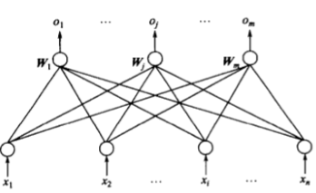
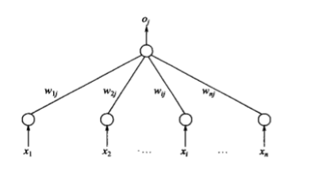
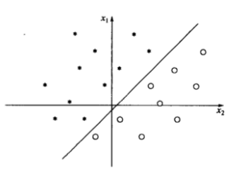
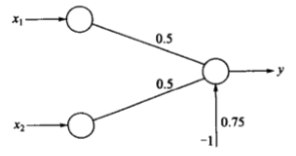
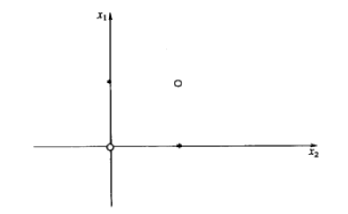
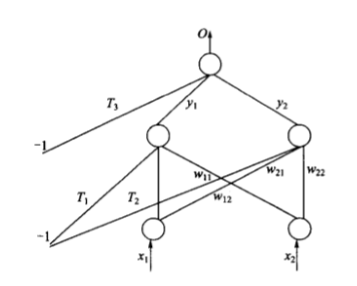
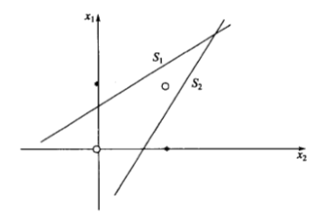
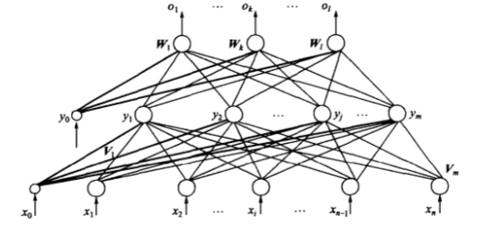
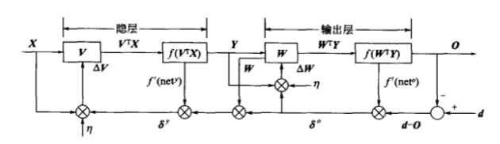

# 监督学习神经网络

感知机神经网络是一种典型的前馈神经网络，具有分层结构，信息冲输入层进入网络，逐层向前传递至输出层。根据感知机神经元激活函数、隐层数以及权值调整规则的不同，可以形成具有各种功能特点的神经网络。

## 单层感知机

由美国心理学家提出的一种具有单层计算单元的神经网络，称为Perceptron，即感知机。感知机模拟人的视觉接受环境信息，并由神经冲动进行信息传递。感知机研究中首次提出了自组织、自学习的思想，而且对所能解决的问题存在这收敛算法，并能从数学上严格证明。

### 感知机模型

单层感知机是指只有一层处理单元的感知机，包括输入层在内，应为两层。其拓扑结构如图所示：

途中输入层也成为感知层，有 n 个神经元节点，这些节点只负责引入外部信息，自身无信息处理能力，每个节点接收一个输入信号，n 个输入信号构成输入向量 X。输出层又 m 个神经元节点，每个节点均有信息处理能力，m 个节点向外部输出处理信息，构成输出向量 O。两城之间的连接权值用 $ W_j $ 表示，m 个权向量构成单层感知机的权值矩阵 W。

其净输入为：$ net_j = W^T X $

激活函数一般采用符号函数，则输出为：

$$ O = sgn(W^T X) $$

### 单节点感知机的功能分析

为了方便分析，只考虑上图中感知机的情况。可以看出，单节点感知机实际上就是一个 M-P 神经元模型，由于采用了符号激活函数，则输出可进一步表达为：

$$ o_j = \left\{
\begin{aligned}
1  (W_j^T > 0) \\
-1(0)  (W_j^T < 0)
\end{aligned}
\right. $$

下面分三种情况讨论单计算节点感知机的功能。

（1）设输入向量 $ X = (x_1, x_2)^T $，则两个输入分量在几何上构成一个二维平面，输入样本可以用该平面上的一个点表示。节点 j 的输出为：

$$ o_j = \left\{
\begin{aligned}
1  (w_{1j}x_1 + w_{2j}x_2 - T_j > 0) \\
-1 (w_{1j}x_1 + w_{2j}x_2 - T_j < 0)
\end{aligned}
\right. $$

则由以下方程确定的直线成为二维输入样本空间上的一条分界线：

$$ w_{1j}x_1 + w_{2j}x_2 - T_j = 0 $$

线上方的样本用点表示，它们使得 $ net_j > 0 $，从而使输出为1；线下方的样本用空心圆表示，它们使得 $ net_j <> 0 $，从而使输出为-1；显然感知机权值和阈值确定的直线方程规定了分界线在样本空间的位置，从而也体现了如何将输入样本分为两类的分类知识与确定规则。假设分界线的初始位置不能将两类样本正确分开，改变权值和阈值，分界线也会随之改变，因此总可以将其调整到正确的分类位置。

（2）将上述结论推广到三维，设输入向量 $ X = (x_1, x_2, x_3)^T $ ，则三个输入分量在几何上构成一个三维空间。节点 j 的输出为：

$$ o_j = \left\{
\begin{aligned}
1  (w_{1j}x_1 + w_{2j}x_2 + w_{3j}x_3 - T_j > 0) \\
-1 (w_{1j}x_1 + w_{2j}x_2 + w_{3j}x_3 - T_j < 0)
\end{aligned}
\right. $$

则由以下方程确定的平面成为三维输入样本空间上的一个分界平面：

$$ w_{1j}x_1 + w_{2j}x_2 + w_{3j}x_3 - T_j = 0 $$

平面上方的样本用点表示，它们使得 $ net_j > 0 $，从而使输出为1；平面下方的样本用空心圆表示，它们使得 $ net_j <> 0 $，从而使输出为-1；显然感知机权值和阈值确定的平面方程规定了分界平面在样本空间的位置，从而也体现了如何将输入样本分为两类的分类知识与确定规则。假设分界平面的初始位置不能将两类样本正确分开，改变权值和阈值，分界平面也会随之改变，因此总可以将其调整到正确的分类位置。

（3）将上述特例推广到 n 维输入空间的一般情况，设输入向量 $ X = (x_1, x_2, x_3, \dots, x_n)^T $ ，则 n 个输入分量在几何上构成一个 n 维空间。由以下方程确定的超平面成为 n 维输入样本空间上的一个分界超平面：

$$ w_{1j}x_1 + w_{2j}x_2 + w_{3j}x_3 + \dots + w_{nj}x_n - T_j = 0 $$

此平面可以将输入样本分为两类。

通过以上分析可以看出，一个最简单的计算节点感知机具有分类功能。其分类原理是将分类知识储存于感知机的权向量（包含阈值）中，由权向量确定的分类平面将输入模式分为两类。

下面研究单计算节点感知机实现逻辑运算的问题。

首先，用感知机实现逻辑“与”功能。逻辑“与”的真值表及感知机结构如下：

$ x_1 $ | $ x_2 $ | $ y $
- | - | -
0 | 0 | 0
0 | 1 | 0
1 | 0 | 0
1 | 1 | 1

从真值表可以看出，4个样本输出有两种情况，一种使输出为0，另一种使输出为1，因此属于分类问题。用感知机学习规则进行训练，得到的连接权值标注在在下图：

令净输入为0，可以得到分类决策方程：

$$ 0.5x_1 + 0.5x_2 - 0.75 = 0 $$

并且该方程并不是唯一的决策方程。

同理，用感知机实现逻辑“或”功能。逻辑“或”的真值表及感知机结构如下：

$ x_1 $ | $ x_2 $ | $ y $
- | - | -
0 | 0 | 0
0 | 1 | 1
1 | 0 | 1
1 | 1 | 1

从真值表可以看出，4个样本的输出也分为两类，一种使输出为0，另一种使输出为1，因此属于分类问题，训练后可以的到连接权值： $ w_1 = w_2 = 1, T = -0.5 $ ，令净输入为0，则得到决策方程：

$$ x_1 + x_2 + 0.5 = 0 $$

显然，该直线也并非唯一解。

### 感知机的局限性以及解决途径

在上面两个例子中，说明单计算节点感知机可具有逻辑“与”和逻辑“或”的功能。那么它是否也具有“异或”的功能呢？

异或真值表：

$ x_1 $ | $ x_2 $ | $ y $
- | - | -
0 | 0 | 0
0 | 1 | 1
1 | 0 | 1
1 | 1 | 0

表中的四个样本也分为两类，但是把他们放到平面直接坐标系可以发现，任何直线也不能将两类样本分开。

如果两类样本可以用直线、平面或者超平面分开，成为线性可分，否者线性不可分。由感知机的几何意义可知，由于净值输入为0确定的决策边界方程是线性方程，因而他只能解决线性可分性问题而不可能解决线性不可分问题。由此可知，单层感知机的局限是：仅对线性可分问题具有分类能力。

解决方法：

在输入层和输出层之间引入隐层作为输入模式的“内部表示”，将单层感知机变成多层感知机。

示例：

根据上图给出一个单隐层的感知机，其中隐层的两个节点相当于两个独立的符号单元（单计算节点感知机）。根据之前的魔术，这两个符号单元可以分别在 $ x_1 - x_2 $ 平面上确定一条分解直线 $ S_1 $ 和 $ S_2 $ ，从而构成如下图所示的开放式凸域。显然，通过适当的调节两条直线的位置，可以使两类线性不可分问题分别位于该开放式凸域的内部和外部。因此对隐节点1来说，直线 $ S_1 $ 下面的样本使其输出为 $ y_1 = 1 $ ，而直线上方的样本示器输出为 $ y_1 = 0 $ ；对隐节点2来说，直线 $ S_1 $ 上面的样本示器输出为 $ y_2 = 1 $ ，而直线下面的样本示器输出为 $ y_2 = 0 $ 。

当输入样本为空心圆类时，其位置出于开放式凸域的内部，即处在 $ S_1 $ 下方和 $ S_2 $ 的上方。根据以上分析，$ y_1 = 1, y_2 = 1 $。

当输入样本为点类时，其位置出于开放式凸域的外部，即处在 $ S_1 $ 和 $ S_2 $ 的上方或下方。根据以上分析，$ y_1 = 0, y_2 = 1 或 y_1 = 1, y_2 = 0 $。

输出层节点以隐层两节点的输出作为输入，其结构也相当于一个符号单元。如果经过悬链，示器具有逻辑“与非”功能，则异或问题可以得到解决。

异或感知机结构

样本 | $ x_1 $ | $ x_2 $ | $ y_1 $ | $ y_2 $ | $ o $
- | - | - | - | - | -
$ X^1 $ | 0 | 0 | 1 | 1 | 0
$ X^2 $ | 0 | 1 | 0 | 1 | 1
$ X^3 $ | 1 | 0 | 1 | 0 | 1
$ X^4 $ | 1 | 1 | 1 | 1 | 0

根据感知机原理，不难想象，放输入样本为二位向量时，隐层中每个节点确定了二维平面的一条分解直线。多条直线经输出节点组合后构成各种形状的凸域。通过训练凸域的形状，可将两类线性不可分样本分为域外和域内。输出层节点负责将与内外的两类样本进行分类。

当单隐层感知机具有多个节点时，节点的数量增加可以使多边形凸域边数增加，从而在输入空间构建出任意形状的凸域。如果再次基础上增加一层，成为第二个隐层，则该层的每个节点确定一个凸域，各个凸域经输出层节点组合后可以成为任意形状域。组合后，分类能力比单隐层大大提升。分类问题越复杂，不同类样本在样本空间的布局越趋于交错分布，因而隐层需要的节点神经元点数也越多。

理论表明：双隐层感知机足以解决任意复杂度的分类问题（该结论已经过严格的数学证明）。

为了便于直观描述感知机的分类能力，之前的分析中都是用符号函数（或单位阶跃函数）作为激活函数。实际上，提高感知机分类能力的另一个途径是，采用非线性连续函数作为神经元节点的激活函数。这样做的好处是能使决策边界的基本线素由直线变成曲线，从而使整个边界线变为连续光滑的曲线。

关于感知机中增加隐层后可以解决非线性可分问题，也可以从非线性映射的角度来理解。若将上表中的数据点分别放置在由 $ x_1-x_2 $ 构成的输入空间以及由 $ y_1-y_2 $ 构成的隐空间，可以看出由于样本  和  被映射到隐空间的同一位置，从而使得在输入空间非线性可分的 4 个样本点映射到隐空间后为线性可分，因而由输出层节点确定分类决策边界可将映射到隐空间的两类样本分开。

简单的感知机只能且介先行问题，能够求解非线性问题的网络应具有隐层，但但与各隐层节点来说，没有期望输出，则之前介绍的规则——权值调整量取决于感知机期望输出与实际输出只差，对于隐层权值不适用。

含有隐层的多层感知机能大大提升网络分类能力，但是由于没有期望输出，导致之前的学习规则不适用。后来由众多科学家研究，对具有非线性连续激活函数的多层感知机的误差反向传播（error back proragation，简称BP）算法进行了详尽的分析，实现了多层网络的设想。由于多层感知机的训练经常采用误差反向传播算法，人们也经常吧多层感知机直接称为 BP 网络。

## BP神经网络

BP 算法的基本思想是：学习过程由信号正向传播与误差反向传播两个过程组成，正向传播时，输入样本从输入层传入，经各隐层逐层处理后，传向输出层。若输出层的实际输出与期望的输出不符，则转入误差的反向传播阶段。误差反向传播是将输出误差以某种形式通过隐层向输入层逐层反传，并将误差分摊给各层的所有单元，从而获得各层单元的误差信号，此误差信号即作为修正各单元权值的依据。这种信号正向传播与误差反向传播的各层权值调整过程是周而复始地进行的。权值不断调整的过程，也就是网络的学习训练过程。此过程一直进行到网络输出的误差减少到可见收的程度，或进行到预先设定的学习次数为止。

### BP网络模型

采用 BP 算法的多层感知机是迄今为止应用最广泛的神经网络，在多层感知机的应用中，以单隐层感知机最为普遍。一般称之为三层感知机，所谓三层：输入层、隐层、输出层。

三层感知机中，输入向量 $ X = (x_1, x_2, \dots, x_i, \dots, x_n)^T $ ，其中 $ x_0 = -1 $ 是为隐层神经元引入阈值而设置的；隐层输出向量 $ Y = (y_1, y_2, \dots, y_j, \dots, y_m)^T $ ，其中 $ y_0 = -1 $ 是为输出层神经元引入阈值而设置的；输出层输出的向量为 $ O = (o_1, o_2, \dots, o_k, \dots, o_l)^T $ ；期望输出向量 $ d = (d_1, d_2, \dots, d_k, \dots, d_l)^T $ 。输入层到隐层之间的权值矩阵用 V 表示，$ V = (V_1, V_2, \dots, V_j, \dots, V_m)^T $  ，其中列向量 $ V_j $ 为隐层第 j 个神经元对应的权向量；隐层到输出层之间的权值矩阵用 W 表示， $ W = (W_1, W_2, \dots, W_k, \dots, W_i)^T $ ，其中列向量 $ W_k $ 为输出层第 k 个神经元对应的权向量。

对于输出层，有：

$$ o_k = f(net_k) \quad k = 1,2,\dots,l $$

$$ net_k = \sum_{j = 0}^m w_{jk} y_j \quad k = 1,2,\dots,l $$

对于隐层，有：

$$ y_j = f(net_j) \quad j = 1,2,\dots,m $$

$$ net_j = \sum_{i = 0}^n v_{ij} x_i \quad j = 1,2,\dots,m $$

以上两式中，转移函数 f(x) 均为单极性 Sigmoid 函数：

$$ f(x) = \frac{1}{1+e^{-x}} $$

f(x)具有连续、可导的特点，且有：

$$ f'(x) = f(x)[1-f(x)] $$

根据需要也可以采用双极性的 Sigmoid 函数：

$$ f(x) = \frac{1-e^{-x}}{1+e^{-x}} $$

### BP学习算法

以下将以三层感知机为例介绍 BP 学习算法，然后推广到一般多层感知机。

#### 网络误差定义和权值调整思路

当网络输出与期望输出不等时，存在输出误差 E，定义如下：

$$ E = \frac{1}{2}(d-O)^2 = \frac{1}{2}\sum_{k=1}^l (d_k - o_k)^2 $$

将以上误差定义式展开到隐层，有：

$$ E = \frac{1}{2}\sum_{k=1}^l [d_k - f(net_k)]^2 = \frac{1}{2}\sum_{k=1}^l [d_k - f(\sum_{j=0}^m w_{jk} y_i)]^2 $$

进一步展开到输出层，有：

$$ E = \frac{1}{2}\sum_{k=1}^l \{d_k - f[\sum_{j=0}^m w_{jk} f(net_j)]\}^2 =  \frac{1}{2}\sum_{k=1}^l \{d_k - f[\sum_{j=0}^m w_{jk} f(\sum_{j=0}^m v_{ij} x_i)]\}^2 $$

由上式可以看出，网络误差是各层权值 $ w_{jk}, v_{ij} $ 的函数，因此调整权值可以改变误差 E （从最小化损失函数的角度看，损失函数也称为目标函数或者代价函数）。

显然，调整权值的原则是使误差不断的减少，因此应使权值的调整量与误差的梯度下降成正比，即：

$$ \Delta w_{jk} = -\eta \frac{\partial E}{\partial w_{jk}} \quad j=0,1,2,\dots,m;k=1,2,\dots,l $$

$$ \Delta v_{ij} = -\eta \frac{\partial E}{\partial v_{ij}} \quad i=0,1,2,\dots,n;j=1,2,\dots,m $$

式中，符号表示梯度下降，常数 $ \eta \in (0, 1) $ 表示比例系数，在训练中反映了学习率。可以看出，BP算法属于 $ \delta $ 学习规则类，这类算法常被称为误差的梯度下降算法。

#### BP算法的推导

上述两式，进士对权值调整思路的数学表达，而不是具体权值调整计算式。下面我们推导三层 BP 算法权值调整计算式。事先约定，在全部推导过程中，对输出层均有 $ j = 0,1,2,\dots,m; k = 1,2,\dots,l $ ；对隐层均有 $ i = 0,1,2,\dots,n; j = 1,2,\dots,m $ 。

对于输出层：

$$ \Delta w_{jk} = -\eta \frac{\partial E}{\partial w_{jk}} = -\eta \frac{\partial E}{\partial net_k} \frac{\partial net_k}{\partial w_{jk}} $$

对于隐层：

$$ \Delta v_{ij} = -\eta \frac{\partial E}{\partial v_{ij}} = -\eta \frac{\partial E}{\partial net_j} \frac{\partial net_j}{\partial v_{ij}} $$

对输入层和隐层各定义一个误差信号，令：

$$ \delta_k^o = - \frac{\partial E}{\partial net_k} $$

$$ \delta_j^y = - \frac{\partial E}{\partial net_j} $$

综合上述式子：

$$ \Delta w_{jk} = \eta \delta_k^o y_j $$

$$ \Delta v_{ij} = \eta \delta_j^y x_i $$

乐意看出，只要计算出误差信号，权值调整量的计算推导即可完成。

继续推导如何求误差信号：

对于输出层， $ \delta_k^o $ 可展开为：

$$ \delta_k^o = -\frac{\partial E}{\partial net_k} = -\frac{\partial E}{\partial o_k} \frac{\partial o_k}{\partial net_k} = -\frac{\partial E}{\partial o_k}f'(net_k) $$

对于隐层，  可展开为：

$$ \delta_j^y = - \frac{\partial E}{\partial net_j} = -\frac{\partial E}{\partial y_j} \frac{\partial y_j}{\partial net_j} = -\frac{\partial E}{\partial y_j}f'(net_j) $$

下面求上式中网络误差对各层输出的偏导。

对于输出层，利用误差定义可得：

$$ \frac{\partial E}{\partial o_k} = -(d_k - o_k) $$

对于隐层，利用误差在隐层的展开式可得：

$$ \frac{\partial E}{\partial y_j} = - \sum_{k=1}^l (d_k - o_k)f'(net_k)w_{jk} $$

将上述结果带入 $ \delta_k^o, \delta_j^y $ ，并利用激活函数 $ f'(x) = f(x) [1-f(x)] $ 的性质可得：

至此，两个误差信号的推导已完成，得到三层感知机的 BP 学习算法权值调整公式为：

$$ \left\{
\begin{aligned}
\Delta w_{jk} = \eta \delta_k^o y_j = \eta(d_k - o_k) o_k (1 - o_k) y_i \\
\Delta v_{ij} = \eta \delta_j^y x_i = \eta (\sum_{k=1}^l \delta_k^o w_{jk}) y_j (1 - y_j) x_i
\end{aligned}
\right. $$

对于多层感知机，设共有 h 个隐层，按前向顺序各隐层节点数分别记为 $ m_1,m_2,\dots,m_h $ ，各隐层输出分别记为 $ y^1,y^2,\dots,y^h $ ，各隐层权值矩阵分别记为 $ W^1,W^2,\dots,W^h,W^{h+1} $ ，则各层权值调整公式为：

输出层：

$$ \Delta w_{jk}^{h+1} = \eta \delta_k^{h+1} y_j^h = \eta(d_k - o_k) o_k (1-o_k)y_j^h \quad j=0,1,2,\dots,m_h;k=1,2,\dots,l $$

第 h 隐层：

$$ \Delta w_{ij}^h = \eta \delta_j^h y^{h-1} = \eta (\sum_{k=1}^l \delta_k^o w_{jk}^{h+1}) y_j^h (1 - y_j^h) y_j^{h-1} \quad i=0,1,2,\dots,m_{h-1};j=1,2,\dots,m_h $$

按以上规律逐层类推，则第一隐层权值调整计算公式：

$$ \Delta w_{pq}^1 = \eta \delta_q^1 y^1 = \eta (\sum_{r=1}^{m_2} \delta_r^2 w_{qr}^2) y_q^1 (1 - y_q^1) x_p \quad p=0,1,2,\dots,n;q=1,2,\dots,m_1 $$

三层感知机的 BP 学习算法也可以写成向量形式。

对于输出层，设 $ Y=(y_0,y_1,dots,y_m)^T, \delta^o=(\delta_1^o,\delta_2^o,dots,\delta_k^o,\dots,\delta_l^o)^T $ ，则：

$$ \Delta W = \eta (\delta^o Y^T)^T $$

对于隐层，设 $ X=(x_0,x_1,dots,x_i,\dots,x_n)^T, \delta^y=(\delta_1^y,\delta_2^y,dots,\delta_j^y,\dots,\delta_m^y)^T $ ，则：

$$ \Delta V = \eta (\delta^y X^T)^T $$

容易看出，BP学习算法中，各层权值调整公式形式上都是一样的，均有3个因素决定，即：学习率 $ \eta $ 、本层输出的误差信号 $ \delta $ 以及本层输入信号 $ Y(或X) $ 。其中输出层误差信号与网络的期望输出和实际输出之差有关，直接反映了误差，而各隐层的误差信号与前面各层误差信号都有关，是从输出层开始逐层反传过来的。

#### BP 算法的信号流向

如上图，BP算法的特点是信号的向前计算和误差的反向传播。

由图中可以看出，向前的过程是：输入信号 X 从输入层进入后，通过各隐层节点的内星权向量 V 的到该层的输出信号 Y；该信号向前输入到输出层，通过其各节点内星权向量 W 得到该层的输出 O。反向的过程是：在输出层期望输出 d 与实际输出 O 相比较得到误差信号 $ \delta^o $ ，由此可计算出输出层权值的调整量；误差信号 $ \delta^o $ 通过隐层各节点的外星向量反传至隐层各节点，得到隐层的误差信号 $ \delta^y $ ，由此可计算出隐层权值的调整量。

### BP网络的主要能力

（1）非线性映射能力

BP网络能学习和存储大量输入-输出模式的映射关系，而无需实现了解这种映射关系的数学方程。只要能提供足够多的样本模式对供 BP 网络进行学习训练，它便能完成由 n 维输入空间到 m 维输出空间的非线性映射。

在工程上及许多技术领域中经常会遇到这样的问题：对某输入-输出系统已积累了大量的相关的输入-输出数据，但对其内部蕴含的规律仍未掌握，无法用数学方法描述。这一类问题的共同特点：难以得到解析解、缺乏专家经验、能够表示和转化为模式识别或非线性映射问题。对于这类问题，多层感知机具有无可比拟的优势。

（2）泛化能力

BP网络训练后将所提取的样本对中的非线性映射关系存储在权值矩阵中，在其后的工作阶段，当向网络输入训练时未曾见过的非样本数据时，网络也能完成由输入空间到输出空间的正确映射。这种能=能力称为多层感知机的泛化能力，它是衡量多层感知机的一个重要方面。

（3）容错能力

BP网络的有点还在于，允许输入样本中带有较大的误差甚至个别错误。因为对权值矩阵的调整过程也是从大量样本中提取统计特性的过程，反映正确规律的知识来自全样本。个别样本中的误差不能左右对权值矩阵的调整。

### 误差曲面与BP算法的局限性

BP网络的误差是各层权值和输入样本对的函数，因此可以表达为：

$$ E = F(X^p, W, V, d^p) $$

所以，误差 E 是 n + 1 维上极为复杂的曲面，该曲面上每个点的“高度”对应一个误差值。可以想象到误差曲面的分布具有以下两个特点：

（1）存在平坦区域

误差曲面上有些区域比较平坦，在这些区域中，误差的梯度变化的比较小，计师权值的调整量很大，误差仍然下降缓慢。造成这种情况的原因与各节点的净输入过大有关。

BP算法是严格遵从误差梯度下降的原则调整权值，训练进入平坦区后，尽管实际输出与期望输出仍然误差很大，但是由于误差梯度小而使得权值调整力度减小，训练只能以增加迭代次数为代价缓慢进行。只要调整的方向正确，调整的时间足够长，总可以退出平坦区而进入某个谷点。

（2）存在多个极小值

二维权空间的误差曲线像一片连绵起伏的山脉，其低凹的部分就是误差函数的极小点。可以想象，高维权空间的误差曲面“山势”更加复杂，因而会有更多的极小点。多数极小点都是局部极小，即使是全局极小往往也不是唯一的，其特点是误差梯度为零。误差曲面的这一特点使得以误差梯度下降为权值调整依据的BP算法无法辨别极小点的性质，因而常常陷入某个局部最小无法自拔。

## BP算法改进

## BP网络设计
