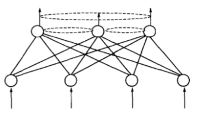
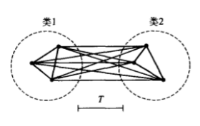
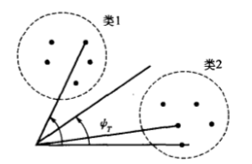
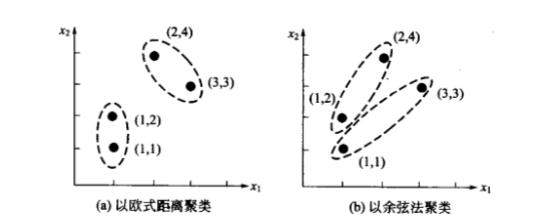
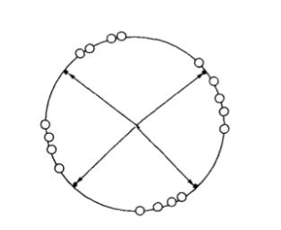
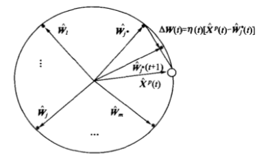
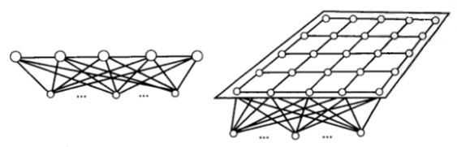
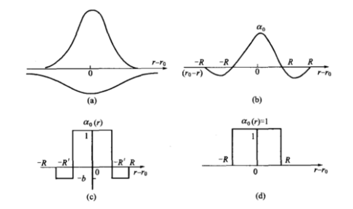

# 竞争学习神经网络

采用有监督学习规则的神经网络要求对所学习的样本给出“正确答案”，以便网络据此判断输出的误差，根据误差的大小改进自身的权值，提高正确解决问题的能力。然而在很多情况下，人在认知过程中没有预知的正确模式，人获得大量知识常常是靠“无师自通”，即通过对客观事物的反复观察、分析与比较，自行揭示其内在规律，并对具有共同特征的事物进行正确归类。对于人的这种学习方式，基于有监督学习策略的神经网络是无能为力的。自组织神经网络的无监督学习方式更类似于人类大脑中生物神经网络的学习，其最重要的特点是通过自动寻找样本中的内在规律和本质属性，自组织、自适应地改变网络参数与结构。这种学习方式大大拓宽了神经网络在模式识别与分类方面的应用。

自组织网络结构上属于层次型网络，有多种类型，其共同特点是都具有竞争层。最简单的网络结构具有一个输人层和一个竞争层，如下图所示。输入层负责接受外界信息并将输入模式向竞争层传递，起“观察”作用，竞争层负责对该模式进行“分析比较”，找出规律以正确归类。这种功能是通过下面要介绍的竞争机制实现的。

## 竞争学习的概念与原理

竞争学习是自组织网络中最常采用的一种学习策略。

### 基本概念

#### 模式、分类、聚类与相似性

在神经网络应用中，输入样本、输入模式、输入模式样本这类术语经常混用。一般当神经网络涉及识别、分类问题时常常用到输入模式的概念。模式是对某些感兴趣的客体的定量描述或结构描述，模式类是具有某些共同特征的模式的合。分类是在类别知识等标签信号的指导下，将待识别的输人模式分配到各自的模式类中去。无监督指导的分类称为聚类，聚类的目的是将相似的模式样本划归一类，而将不相似的分离开，其结果实现了模式样本的类内相似性和类间分离性。通过聚类，可以发现原始样本的分布与特性。

由于无监督学习的训练样本中不含有期望输出，因此对于某一输人模式样本应属于哪类并没有任何先验知识。对于一组输入模式，只能根据它们之间的相似程度分为若干类，因此相似性是输入模式的聚类依据。关于聚类分析的研究，需要解决的问题是：如何决定相似度；如何决定聚类的类别数;如何决定哪种分类的结果是理想的。

#### 相似性测量

神经网络的输入模式用向量表示，比较两个不同模式的相似性可转化为比较两个向量的距离，因而可用模式向量间的距作为聚类判据。传统模式识别中常用到的两种聚类判据是欧式距离法和余弦法。下面分别予以介绍:

(1)欧式距离法为了描述两个输入模式的相似性，常用的方法是计算其欧式距离，即:

$$ \vert \vert X - X_i \vert \vert = \sqrt{(X - X_i)^T(X - X_i)} \tag 1 $$

两个模式向量的欧式距离越小，两个向量越接近，因此认为这两个模式越相似，当两个模式完全相同时其欧式距离为零如果对同一类内各个模式向量间的欧式距离作出规定，不允许超过某一最大值T，则最大欧式距离T就成为一种聚类判据。从下图可以看出同类模式向量的距离小于T，两类模式向量的距离大于T。

(2)余弦法描述两个模式向量的另一个常用方法是计算其夹角的余弦，即:

$$ cos ψ = \frac{X^T X_i}{\vert \vert X \vert \vert \quad \vert \vert X_i \vert \vert} \tag 2 $$

从下图可以看出，两个模式向量越接近，其夹角越小，余弦越大。当两个模式方向完全相同时，其夹角余弦为1。如果对同一类内各个模式向量间的夹角作出规定，不允许超过某一最大角ψ，则最大夹角中就成为一种聚类判据。同类模式向量的夹角小于ψ，两类模式向量的夹角大于中。余弦法适合模式向量长度相同或模式特征只与向量方向相关的相似性测量。

(3)内积法描述两个模式向量的第三种常用方法是计算其内积，即:

$$ X^T X_i = \vert \vert X \vert \vert \quad \vert \vert X_i \vert \vert cos ψ $$

内积值越大则相似度越高，当两个模式方向完全相同且长度相等时，其相似度取最大值。

不同的相似度会导致所形成之聚类几何特性不同。如下图所示，若用欧式距离法度量相似度，会形成大小相似且紧密的圆形聚类;若用余弦法度量相似度，将形成大体同向的狭长形聚类。倘若用内积法度量相似度，则不一定会形成大体同向的狭长形聚类，因为即使两个向量角度几乎相同，但其长度有很大差别，其内积值仍会有较大差异。

#### 侧抑制与竞争

实验表明，在人眼视网膜、脊髓和海马中存在一种侧抑制现象，即当一个神经细胞兴奋后，会对其周围的神经细胞产生抑制作用。这种侧抑制使神经细胞之间呈现出竟争，开始时可能多个细胞同时兴奋，但一个兴奋程度最强的神经细胞对周围神经细胞的抑制作用也越强，其结果使其周围神经细胞兴奋度减弱，从而该神经细胞是这次竞争的“胜者”，而其他神经细胞在竞争中失败。图1.1，即本文最上面的图中的虚线表示了相互抑制的权值。这类抑制性权值常满足一定的分布关系，如距离近的抑制强，距离远的抑制弱。由于权值一般是固定的，训练过程中不需要调整，在各类自组织网络拓扑图中般予以省略。最强的抑制作用是竞争获胜者“唯我独兴”，不允许其他神经元兴奋，这种做法称为胜者为王。

#### 向量归一化

不同的向量又长短和方向的区别，向量归一化的目的是将向量变成方向不变长度为1的单位向量。二维和三位向量可以在单位元和单位球上直观表示。单位向量进行比较时，只需比较向量的夹角。向量的归一化按下式进行：

$$ \hat X = \frac{X}{\vert \vert X \vert \vert} = (\frac{x_1}{\sqrt{\sum_{j=1}^n x_j^2}} \dots \frac{x_n}{\sqrt{\sum_{j=1}^n x_j^2}})^T \tag 3 $$

式中，归一化后的向量用“ $ \hat{} $ ”表示

### 竞争学习原理

竞争学习采取的规则是胜者为王。

#### 竞争学习规则

在竞争学习策略中采用的典型学习规则称为胜者为王。该算法可分为三个步骤：

（1）向量归一化  首先将自组织网络的当前输入模式向量 $ X $ 和竞争层中各神经元对应的内星向量 $ W_j (j=1,2,\dots,m) $ 全部进行归一化，得到 $ \hat{X} $ 和 $ \hat{W}_j (j=1,2,\dots,m) $。

（2）寻找获胜神经元  当网络得到一个输入向量 $ \hat{X} $ 时，竞争层的所有神经元对应的内星权向量 $ \hat{W}_j (j=1,2,\dots,m) $ 均与 $ \hat{X} $ 进行相似性比较，将与 $ \hat{X} $ 最相似的内星权向量判为竞争获胜神经元，其权向量记为 $ \hat{W_j}' $ 。测量相似性的方法是对 $ \hat{W_j} $ 和 $ \hat{X} $ 计算欧式距离或夹角余弦：

$$ \vert \vert \hat{X} - \hat{W_j}' \vert \vert = \min_{j \in \{1,2,\dots,m\}} \{ \vert \vert \hat{X} - \hat{W_j} \vert \vert \} \tag 4 $$

将上式展开并利用单位向量的特点可得：

$$ \vert \vert \hat{X} - \hat{W_j}' \vert \vert = \sqrt{(\hat{X} - \hat{W_j}')^T(\hat{X} - \hat{W_j}')} = \sqrt{\hat{X}^T \hat{X} - 2\hat{W_j'}^T \hat{X} + \hat{W_j'}^T \hat{W_j'}} = \sqrt{2(1 - \hat{W_j'}^T \hat{X})} $$

从上式可以看出，欲使两向量欧式距离最小，需使两向量的点积最大，即：

$$ \hat{W_j'}^T \hat{X} = \max_{j \in \{1,2,\dots,m\}} (\hat{W_j}^T \hat{X}) \tag 5 $$

欲使按式(4)求最小欧式距离的问题就转化为按式(5)求最大点积的问题，而权向量与输入向量的点积正式竞争层神经元的净输入。

（3）网络输出与权值调整

胜者为王竞争学习算法规定，获胜神经元输出为1，其余输出为0.即：

$$ o_j(t+1) = \left\{
\begin{aligned}
1 \quad j = j' \\
0 \quad j \neq j'
\end{aligned}
\right. $$

只有获胜神经元才有权调整其权向量 $ W_j' $ ，调整后权向量为：

$$ \left\{
\begin{aligned}
W_j'(t+1) = \hat{W_j}'(t) + \Delta W_j' = \hat{W_j}'(t) + \alpha (\hat{X} - \hat{W_j}') \quad  j = j' \\
W_j(t+1) = \hat{W_j}(t) \quad j \neq j'
\end{aligned}
\right. $$

式中， $ \alpha \in (0, 1] $ 为学习率，一般其值随着学习进展而减小。可以看出，当 $ i \neq j' $ 时，对应的神经元的权值得不到调整，其实质是“胜者”对他们进行了强侧抑制，不允许他们兴奋。

应当指出，归一化后的权向量经过调整后得到的新向量不再是单位向量，因此需要对调整后的向量进行重新归一化。步骤（3）完成后回到步骤（1）继续训练，知道学习率 $ \alpha $ 衰减到0.

#### 竞争学习的原理

设输入模式为2维向量，归一化后其矢端可以看成分布在下图单位圆上的点，用“o”表示。设竞争层有4个神经元，对应的4个内星向量归一化后也标在同一单位圆上，用“·”表示。从输入模式点的分布可以看出，它们大体上聚集为4簇，因而可以分为4类。然而自组织网络的训练样本中只提供了输入模式而没有提供关于分类的指导信息，网络是如何通过竞争机制自动发现样本空间的类别划分呢?

自组织网络在开始训练前先对竞争层的权向量进行随机初始化。因此在初始状态时，单位圆上的·是随机分布的。前面已经证明，两个等长向量的点积越大，两者越近似，因此以点积最大获胜的神经元对应的权向量应最接近当前输入模式。从上图可以看出，如果当前输入模式用空心圆表示，单位圆上各·点代表的权向量依次同○点代表的输入向量比较距离，结果是离得最近的那个·点获胜。从获胜神经元的权值调整式可以看出，调整的结果是使 $ W_m $ 进一步接近当前输入 $ X $。这一点从下图的向量合成图上可以看得很清楚。调整后，获胜·点的位置进一步移向O点及其所在的簇。显然，当下次出现与○点相像的同簇内的输入模式时，上次获胜的·点更容易获胜。依此方式经过充分训练后，单位圆上的4个·点会逐渐移人各输人模式的簇中心，从而使竞争层每个神经元的权向量成为输人模式一个聚类中心。当向网络输入一个模式时，竟争层中哪个神经元获胜使输出为1，当前输入模式就归为哪类。

## 自组织特征映射神经网络

自组织神经网络（self-organizing feature map，简称SOM）是根据人脑自组织特性提出来的，一个神经网络接受外界输入模式时，将会分为不同的对应区域，各区域对输入模型具有不同的响应特征，而且这个过程是自动完成的。

### SOM网的生物学基础

生物学研究的事实表明，在人脑的感觉通道上，神经元的组织原理是有序排列。因此当人脑通过感官接受外界的特定时空信息时，大脑皮层的特定区域兴奋，而且类似的外界信息在对应区域是连续映象的。例如，生物视网膜中有许多特定的细胞对特定的图形比较敏感，当视网膜中有若干个接收单元同时受特定模式刺激时，就使大脑皮层中的特定神经元开始兴奋，输入模式接近，对应兴奋神经元也相近。在听觉通道上，神经元在结构排列上与频率的关系十分密切，对于某个频率，特定的神经元具有最大的响应，位置邻近的神经元具有相近的频率特征，而远离的神经元具有频率特征差别也较大。大脑皮层中神经元的这种响应特点不是先天安排好的，而是通过后天的学习自组织形成的。

对于某一图形或某一频率的特定兴奋过程是自组织特征映射网中竞争机制的生物学基础。而神经元的有序排列以及对外界信息的连续映象在自组织特征映射网中也有反映，当外界输入不同的样本时，网络中哪个位置的神经元兴奋开始是随机的，但自组织训练后会在竞争层形成神经元的有序排列，功能相近的神经元非常靠近，功能不同的神经元离得较远。这一特点与人脑神经元的组织原理十分相似。

### SOM网的拓扑结构和权值调整域

#### 拓扑结构

SOM网共有两层，输入层各神经元通过权向量将外界信息汇集到输出层的各神经元。输入层的形式与BP网相同，节点数与样本维数相等。输出层也是竞争层，神经元的排列有多种形式，如一维线阵、二维平面阵和三维栅格阵。常见的是前两种类型，下面分别予以介绍。

输出层按一维阵列组织的SOM网是最简单的自组织神经网络，其结构特点与下图左中的网络相同，图4.6中的一维阵列SOM网的输出层只标出相邻神经元间的侧向连接。输出按二维平面组织是SOM网最典型的组织方式，该组织方式更具有大脑皮层的形象。输出层的每个神经元同它周围的其他神经元侧向连接，排列成棋盘状平面，结构如下图右所示。

#### 权值调整域

SOM网采用的学习算法称为 Kohonen算法，是在胜者为王算法基础上加以改进而成的，其主要区别在于调整权向量与侧抑制的方式不同。在胜者为王算法中，只有竞争获胜神经元才能调整权向量，其他任何神经元都无权调整，因此它对周围所有神经元的抑制是“封杀”式的。而SOM网的获胜神经元对其邻近神经元的影响是由近及远，由兴奋逐渐转变为抑制，因此其学习算法中不仅获胜神经元本身要调整权向量，它周围的神经元在其影响下也要程度不同地调整权向量。这种调整可用下图中的三种函数表示，其中下图(b)中的函数曲线是由下图(a)中的两个正态曲线组合而成的。

将下图(b)、(c)和(d)中的三种函数沿中心轴旋转后可形成形状似帽子的空间曲面，按顺序分别称为墨西哥帽函数、大礼帽函数和厨师帽函数。其中墨西哥帽函数是Kohonen提出来的，它表明获胜节点有最大的权值调整量，邻近的节点有稍小的调整量，离获胜节点距离越大，权的调整量越小，直到某一距离R时，权值调整量为零。当距离再远一些时，权值调整量略负，更远时又回到零。墨西哥帽函数表现出的特点与生物系统的十分相似，但其计算上的复杂性影响了网络训练的收敛性。因此在SOM网的应用中常使用与墨西哥函数类似的简化函数，如大礼帽函数和进一步简化的厨师帽函数。

以获胜神经元为中心设定一个邻域半径，该半径圈定的范围称为优胜邻域。在SOM网学习算法中，优胜邻域内的所有神经元均按其离开获胜神经元的距离远近不同程度地调整权值。优胜邻域开始定得很大，但其大小随着训练次数的增加不断收缩，最终收缩到半径为零。

## 自组织特征映射神经网络的设计与应用

## 自适应共振理论
